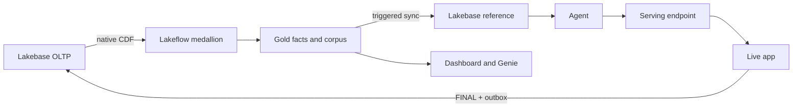

# Steel quality claims adjudication

## Purpose

Reference implementation for governed steel warranty-claim recommendations and human finalization. Deterministic authorities decide eligibility and money; retrieval supplies citations.

### Start here

1. Read the [runbook](docs/RUNBOOK.md) for bootstrap, refresh, release, and recovery order.
2. Use the owning layer README for exact working directories and commands.
3. Compare repository intent with [current live evidence](docs/evidence/current-state/README.md) before operating.

## Objects created

Unity Catalog medallion objects, Lakebase operational and reference tables, an MLflow agent model and serving endpoint, evaluation runs, a Databricks App, an AI/BI dashboard, two Genie spaces, and optional Kafka jobs.

## Resources configured

| Layer | README |
| --- | --- |
| Pipelines | [pipelines](pipelines/README.md) |
| Lakebase | [lakebase](lakebase/README.md) |
| Agent | [agent](agent/README.md) |
| Evaluation | [eval](eval/README.md) |
| App | [app](app/README.md) |
| Dashboards and Genie | [dashboards](dashboards/README.md) |
| Demo | [demo](demo/README.md) |
| Services | [services](services/README.md) |
| Cross-layer composers | [scripts](scripts/README.md) |

All Databricks commands use explicit profile `fe-bar`. Secrets stay in Databricks secret scopes.

## Data flow



## Deploy

Deploy each bundle from its owning directory in the runbook order. There is no root bundle.

## Run

Use `scripts/bootstrap.py` only for a new workspace and `scripts/refresh.py` for composed refreshes. Use the human-gated agent release sequence separately.

## Verify

Working directory: repository root. Read-only checks:

```bash
databricks jobs list --profile fe-bar -o json
databricks pipelines list-pipelines --profile fe-bar -o json
databricks apps get steel-claims-cockpit --profile fe-bar -o json
```

Expected: core jobs are listed, the medallion pipeline is `IDLE` after a completed update, and the app is `RUNNING`. Detailed expected output is committed under [current-state evidence](docs/evidence/current-state/).

Development checks are layer-specific; run the short command line in each layer README. Documentation checks: `git diff --check` plus the repository link and heading checks used by this change.

## Status

2026-10-01: repository head contains all layers. On profile `fe-bar`, the app, medallion, Lakebase synced tables, agent v1 endpoint, dashboard, and Genie spaces are live. The 4,999-row corpus is live, but endpoint v1 still reads legacy `public.prior_claims` until promotion. Services are built but not deployed.
