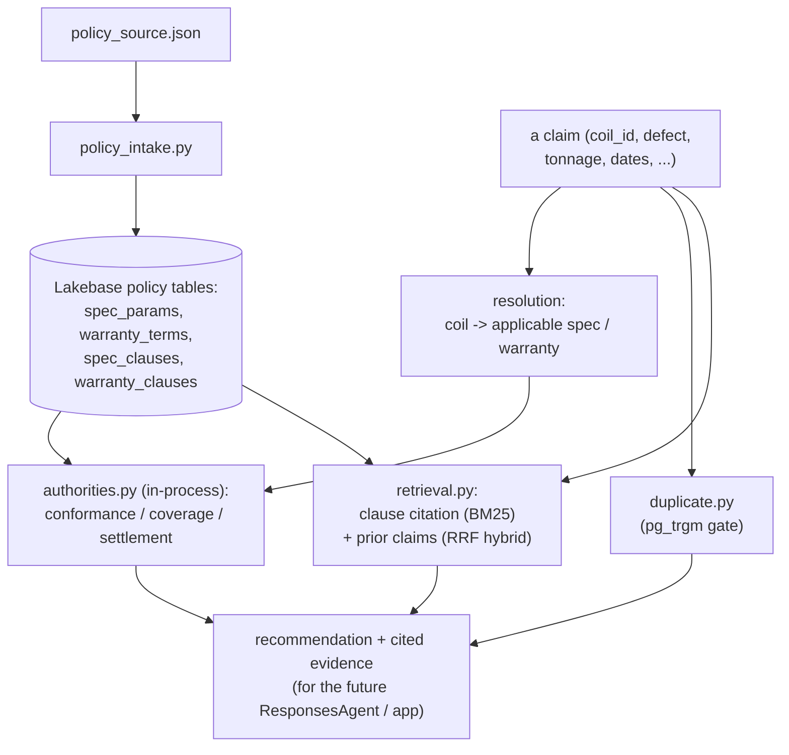

# agent — adjudication agent, deterministic authorities, retrieval, and policy intake

The claims-adjudication agent, the claim-reasoning tools it orchestrates, and the
policy data plane they read. **Deterministic tools decide money; the LLM only
reasons, cites, and recommends** (PLAN §3, §6) — it can never change an authority's
number or verdict. The MLflow 3 `ResponsesAgent` (`src/agent.py`) resolves the
claim once to a frozen policy snapshot, runs the deterministic authorities and the
duplicate gate (which decide eligibility and the amount), gathers advisory context,
lets the reasoning model (`databricks-gpt-5-2`) emit a structured recommendation,
enforces code-level money invariants, and writes an atomic recommendation +
canonical decision record.

## Single source of truth

`src/policy_source.json` is the sole authored policy source. `src/policy_schema.py`
parses it once into two aligned representations ("two representations, one source"):

- **structured params** the authorities read — `spec_params` (grade-level
  chemistry/mechanical ranges, tolerances, coating threshold) and `warranty_terms`
  (product/coating-level duration, full-coverage window, exclusions, proration,
  effective window, freight cap);
- **citable clauses** — `spec_clauses` / `warranty_clauses`, one row per section,
  carrying the metadata and text that hybrid retrieval cites.

The numbers the authorities decide on always come from the params, never the clause
text.

## Objects created

- Native Lakebase policy tables (schema `public`): `spec_params`, `warranty_terms`,
  `spec_clauses`, `warranty_clauses` — created and populated by the intake.
- Fraud-job output: `fe-bar-ir.gold.customer_heat_risk` (Delta CDF enabled so it can
  be served down to Lakebase `reference.customer_heat_risk`).
- Registered model: `fe-bar-ir.default.claims_adjudication_agent`, alias `@prod`.

There are **no** UC functions for the money math. `compute_conformance`,
`compute_coverage`, and `compute_settlement` are pure Python called in-process —
deploying them as UC functions added ~5–6 warehouse round-trips per adjudication for
math that runs in microseconds locally. The append-only decision-record table and
the `adjudications` widening are created by `lakebase/src/decision_records_migration.py`.

## The agent

`src/agent.py` is an MLflow 3 custom `ResponsesAgent` (implements `predict` and
`predict_stream`) running a LangGraph tool-calling loop over
`ChatDatabricks("databricks-gpt-5-2")`. The decision flow per adjudication:

1. **Resolve-once** — bind the claim's coil to a FROZEN policy snapshot
   (`spec_params`, `warranty_terms`, `freight_cap`, natural-key provenance). Every
   tool reuses that one snapshot (`FrozenAdjudicationContext`), so nothing
   re-resolves per call.
2. **Deterministic authorities + duplicate gate** — conformance, coverage, and
   settlement (`authorities.py`, in-process) plus `check_duplicate_claim`. These
   decide verdict eligibility and the amount, unconditionally, before the LLM sees
   anything.
3. **Advisory context** — `retrieve_policy_clauses` (BM25 citation),
   `find_similar_prior_claims` (hybrid, advisory), `get_customer_heat_risk`.
4. **LLM** — a tool-calling loop reasons over the evidence, then a NON-STREAMING
   `response_format` JSON-Schema call emits a recommendation validated by Pydantic.
5. **Code-level invariants** (`decision_record.enforce_invariants`) — a duplicate is
   never payable (⇒ DENY/DUPLICATE); `approved_amount` equals the settlement
   authority output exactly (else 0 when not APPROVE); the verdict is consistent
   with conformance/coverage eligibility. On any violation the recommendation is
   corrected to the deterministic outcome (the LLM never wins) and the violation is
   recorded.
6. **Persist** — one psycopg transaction writes the recommendation into
   `public.adjudications` AND the canonical row into
   `public.adjudication_decision_records` (atomic, idempotent on
   `(adjudication_id, record_version)`).

Every step is a child span (`TOOL`/`RETRIEVER`/`CHAT_MODEL`) under a root `AGENT`
trace whose searchable attributes carry claim/adjudication id, claim type, the
deterministic verdict + duplicate status, model name/version, authorities git-SHA,
cited clause keys, and the final recommendation — no credentials or PII.

## Registration

`src/register_agent.py` logs the agent with `mlflow.pyfunc.log_model`
(`python_model="agent.py"` + sibling `code_paths`), pinned deps, and the
passthrough-auth resources (`DatabricksServingEndpoint("databricks-gpt-5-2")` +
`DatabricksLakebase`), registers it to `fe-bar-ir.default.claims_adjudication_agent`,
validates the isolated artifact with `mlflow.models.predict(env_manager="uv")` on a
real sample claim (`persist=false` — validation never writes), and sets `@prod`. It
does **not** create a serving endpoint. Traces land in a named, non-Git MLflow
experiment.

## Components

| File | Role |
| --- | --- |
| `src/gateway_embed.py` | Shared GTE embedding helper via the Unity Gateway model service `system.ai.gte-large-en`; OAuth token from the SDK, ~16 per batch, 429 retry with backoff, 1024-dim L2-normalized (cosine). Used by both intake and retrieval. |
| `src/policy_intake.py` | Sole creator + populator of the four natural-key policy tables; clause tables carry `tsvector` + `lakebase_bm25` indexes. |
| `src/authorities.py` | Pure `compute_conformance` (incl. gauge + width), `compute_coverage`, `compute_settlement` — the single source of the money math, exercised by the offline tests and called in-process. |
| `src/authorities_runtime.py` | Runtime adapter: fetches params (`public.spec_params` / `warranty_terms`) and coil MTC (`reference.heats_coils` / `mill_test_certs`) over the Lakebase psycopg (5432) path with parameterized queries, then calls the pure authorities in-process. No warehouse on the decision path. |
| `src/duplicate.py` | `check_duplicate_claim` — deterministic record linkage (block by coil + date window, match on defect/amount/tonnage + `pg_trgm` narrative). A gate that can deny money. |
| `src/retrieval.py` | Metadata-filtered BM25 clause citation, plus dense + BM25 reciprocal-rank fusion over the separate `prior_claims` precedent index. Runs at app/agent runtime (psycopg + gateway). |
| `src/heat_risk.py` | `get_customer_heat_risk(customer_id, heat_no)` — reads the synced-down `reference.customer_heat_risk` graph score. Advisory only; never changes an amount or verdict. |
| `src/agent_tools.py` | Resolve-once decision core + the in-process tool callables (authorities, duplicate, clause/precedent retrieval, risk) and the deterministic baseline recommendation. Pure (no LangGraph/MLflow), unit-tested with a fake connection. |
| `src/decision_record.py` | The money-critical spine: the Pydantic recommendation schema + JSON-Schema, the deterministic outcome, `enforce_invariants` (the LLM never overrides an authority), and the canonical decision-record payload builder. |
| `src/writer.py` | Atomic transactional writer — `adjudications` recommendation + `adjudication_decision_records` canonical row in one transaction, idempotent on `(adjudication_id, record_version)`. |
| `src/agent.py` | The MLflow 3 `ResponsesAgent` orchestrator: LangGraph tool loop over `databricks-gpt-5-2`, structured recommendation, MLflow tracing, invariant enforcement, and persistence. |
| `src/register_agent.py` | Log + register + isolated-uv validation + `@prod` alias. |
| `src/offline_validation.py` | Runs the agent on a labeled sample spanning every injected pattern and captures the evidence (recommendation vs authority, decision records, no override). |
| `src/fraud_graph.py` + `src/fraud_graph_job.py` | Connected-components cluster risk over shared heats, scored by customer concentration, written to `gold.customer_heat_risk`. |
| `src/db.py` | Lakebase psycopg connection using an SDK OAuth credential. |

## Data flow



Resolution is deterministic (atomic coil attributes select the applicable
`spec_params` / `warranty_terms` row); the authorities compute the money math on
those params; duplicate detection and retrieval add gates and citable evidence. The
outputs are assembled into a recommendation for the (planned) orchestrator and
adjuster app — no component here decides money using LLM output.

## Run

Intake and retrieval run as local runtime Python (psycopg 5432 + gateway HTTPS),
always with an explicit profile:

```bash
uv run --with "psycopg[binary]==3.2.10" --with "databricks-sdk>=0.81.0" \
  python agent/src/policy_intake.py --profile fe-bar          # idempotent; owns the 4 tables
databricks bundle run fraud_graph -t prod --profile fe-bar    # gold.customer_heat_risk
```

## Development checks

```bash
uv run --with pytest pytest agent/tests -q
uv run --with ruff ruff check agent && uv run --with ruff ruff format --check agent
python3 -m compileall -q agent/src
```

Unit tests cover the authorities against the injected label patterns
(in-spec-should-deny, genuine nonconformance, adhesion failure, out-of-warranty /
environment exclusions, over-claim capping + partials, warranty proration), the
duplicate rule, RRF fusion + metadata filters, the embedding helper
(normalization/batching/429 retry), and the fraud-graph clustering.
