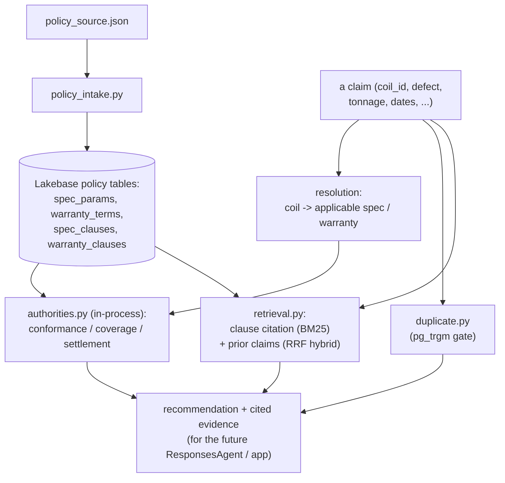

# agent — policy intake, deterministic authorities, and retrieval

The claim-reasoning tools and the policy data plane they read. **Deterministic
tools decide money; the LLM only informs and cites** (PLAN §3, §6). The Mosaic AI
`ResponsesAgent` that will orchestrate these tools into a running agent is a later
workstream — this package delivers the tools and their data plane, not yet the
orchestrator.

## Single source of truth

`src/policy_source.json` is the sole authored policy source. `src/policy_schema.py`
parses it once into two aligned representations ("two representations, one source"):

- **structured params** the authorities read — `spec_params` (grade-level
  chemistry/mechanical ranges, tolerances, coating threshold) and `warranty_terms`
  (product/coating-level duration, full-coverage window, exclusions, proration,
  effective window, freight cap);
- **citable clauses** — `spec_clauses` / `warranty_clauses`, one row per section,
  carrying the metadata and text that hybrid retrieval cites.

The numbers the authorities decide on always come from the params, never the clause
text.

## Objects created

- Native Lakebase policy tables (schema `public`): `spec_params`, `warranty_terms`,
  `spec_clauses`, `warranty_clauses` — created and populated by the intake.
- Fraud-job output: `fe-bar-ir.gold.customer_heat_risk`.

There are **no** UC functions for the money math. `compute_conformance`,
`compute_coverage`, and `compute_settlement` are pure Python called in-process —
deploying them as UC functions added ~5–6 warehouse round-trips per adjudication for
math that runs in microseconds locally.

## Components

| File | Role |
| --- | --- |
| `src/gateway_embed.py` | Shared GTE embedding helper via the Unity Gateway model service `system.ai.gte-large-en`; OAuth token from the SDK, ~16 per batch, 429 retry with backoff, 1024-dim L2-normalized (cosine). Used by both intake and retrieval. |
| `src/policy_intake.py` | Sole creator + populator of the four natural-key policy tables; clause tables carry `tsvector` + `lakebase_bm25` indexes. |
| `src/authorities.py` | Pure `compute_conformance` (incl. gauge + width), `compute_coverage`, `compute_settlement` — the single source of the money math, exercised by the offline tests and called in-process. |
| `src/authorities_runtime.py` | Runtime adapter: fetches params (`public.spec_params` / `warranty_terms`) and coil MTC (`reference.heats_coils` / `mill_test_certs`) over the Lakebase psycopg (5432) path with parameterized queries, then calls the pure authorities in-process. No warehouse on the decision path. |
| `src/duplicate.py` | `check_duplicate_claim` — deterministic record linkage (block by coil + date window, match on defect/amount/tonnage + `pg_trgm` narrative). A gate that can deny money. |
| `src/retrieval.py` | Metadata-filtered BM25 clause citation, plus dense + BM25 reciprocal-rank fusion over the separate `prior_claims` precedent index. Runs at app/agent runtime (psycopg + gateway). |
| `src/fraud_graph.py` + `src/fraud_graph_job.py` | Connected-components cluster risk over shared heats, scored by customer concentration, written to `gold.customer_heat_risk`. |
| `src/db.py` | Lakebase psycopg connection using an SDK OAuth credential. |

## Data flow



Resolution is deterministic (atomic coil attributes select the applicable
`spec_params` / `warranty_terms` row); the authorities compute the money math on
those params; duplicate detection and retrieval add gates and citable evidence. The
outputs are assembled into a recommendation for the (planned) orchestrator and
adjuster app — no component here decides money using LLM output.

## Run

Intake and retrieval run as local runtime Python (psycopg 5432 + gateway HTTPS),
always with an explicit profile:

```bash
uv run --with "psycopg[binary]==3.2.10" --with "databricks-sdk>=0.81.0" \
  python agent/src/policy_intake.py --profile fe-bar          # idempotent; owns the 4 tables
databricks bundle run fraud_graph -t prod --profile fe-bar    # gold.customer_heat_risk
```

## Development checks

```bash
uv run --with pytest pytest agent/tests -q
uv run --with ruff ruff check agent && uv run --with ruff ruff format --check agent
python3 -m compileall -q agent/src
```

Unit tests cover the authorities against the injected label patterns
(in-spec-should-deny, genuine nonconformance, adhesion failure, out-of-warranty /
environment exclusions, over-claim capping + partials, warranty proration), the
duplicate rule, RRF fusion + metadata filters, the embedding helper
(normalization/batching/429 retry), and the fraud-graph clustering.
