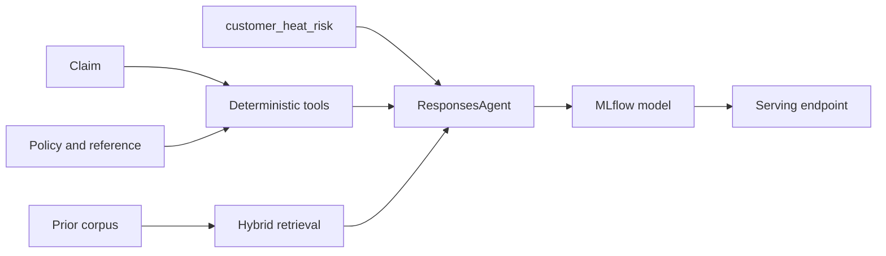

# Agent

## Purpose

Build deterministic claim recommendations with cited policy and precedent, register the MLflow model, and deploy the governed serving endpoint.

The MLflow 3 `ResponsesAgent` resolves each claim once to a frozen policy snapshot, runs deterministic authorities and the duplicate gate, gathers advisory context, and uses a LangGraph tool loop with the governed GPT-5.x reasoning model `system.ai.gpt-5-2`. Model calls route through the OpenAI-compatible Unity Gateway. Code-level invariant checks run before persistence; the language model cannot override eligibility or money.

## Objects created

Jobs `fe-bar-fraud-graph`, `fe-bar-prior-claims-corpus`, and `fe-bar-deploy-claims-adjudication-agent`; registered model `fe-bar-ir.default.claims_adjudication_agent`; endpoint `agents_fe-bar-ir-default-claims_adjudication_agent`.

Append-only decision records store the deterministic baseline, citations, recommendation, model version, and later human-final versions. `gold.customer_heat_risk` is served down as `reference.customer_heat_risk`; it is advisory only.

## Resources configured

Money authorities remain solely in `src/authorities.py`. `gold.prior_claims_corpus` and synced `reference.prior_claims_corpus` are live at 4,999 rows. Endpoint v1 is still the legacy build that reads `public.prior_claims`; do not claim serving uses the new corpus until the next promoted model is deployed and smoked.

There are no UC functions for the money math: conformance, coverage, and settlement run as pure Python in-process deterministic authorities. Deterministic resolution chooses the applicable spec and warranty before retrieval or reasoning.

Clause retrieval is metadata-resolved, not semantic: resolution pre-filters to the applicable policy section, then BM25 only orders clauses within that section. Dense-vector plus BM25 hybrid retrieval with reciprocal-rank fusion (RRF) lives only in the prior-claims corpus. It is advisory; the duplicate gate is the only precedent-related money gate.

In served mode, `src/workspace_client.py` authenticates Unity Gateway and workspace API calls as the dedicated application service principal. Local runs use the explicit profile.

## Data flow


```mermaid
flowchart LR
  C[Claim] --> T[Deterministic tools]
  P[Policy and reference] --> T
  R[Prior corpus] --> Q[Hybrid retrieval]
  H[customer_heat_risk] --> A
  T --> A[ResponsesAgent]
  Q --> A --> M[MLflow model] --> E[Serving endpoint]
```

The sequence is resolution → in-process authorities and duplicate gate → BM25 citations, RRF precedent, and heat risk → LangGraph reasoning → structured output → invariant enforcement. Invariants force duplicates non-payable, amount to equal settlement authority output, and verdict to agree with eligibility. One transaction writes the recommendation and canonical decision record idempotently.

## Deploy

Working directory: `agent/`.

```bash
databricks bundle validate --strict -t prod --profile fe-bar
databricks bundle deploy -t prod --profile fe-bar
```

First-time setup follows `scripts/bootstrap.py`: run `fraud_graph` before the first medallion refresh so it publishes an empty typed `gold.customer_heat_risk`; refresh the medallion; then run `fraud_graph` again with real claims, run `prior_claims_corpus`, and refresh again. Create synced tables after the app and serving principals exist. A routine release is human-gated: register, evaluate, promote, then deploy the endpoint.

## Run

Working directory: `agent/`.

```bash
databricks bundle run fraud_graph -t prod --profile fe-bar
databricks bundle run prior_claims_corpus -t prod --profile fe-bar
uv run python src/register_agent.py --profile fe-bar
uv run python ../eval/src/evaluate.py --profile fe-bar --experiment /Shared/claims-adjudication-offline-evaluation --candidate-version N
uv run python ../eval/src/promote.py --profile fe-bar --candidate-version N --promote
databricks bundle run deploy_claims_agent -t prod --profile fe-bar
databricks serving-endpoints query agents_fe-bar-ir-default-claims_adjudication_agent --profile fe-bar --json "$(jq -c '.custom_inputs.persist=false | del(.endpoint)' ../docs/evidence/serving-endpoint/smoke-request.json)"
```

The example forces `custom_inputs.persist=false`, so invocation is read-only.

## Verify

Working directory: `agent/`. Read-only:

```bash
databricks serving-endpoints get agents_fe-bar-ir-default-claims_adjudication_agent --profile fe-bar -o json
databricks model-versions get-by-alias fe-bar-ir.default.claims_adjudication_agent prod --profile fe-bar -o json
databricks model-versions get-by-alias fe-bar-ir.default.claims_adjudication_agent candidate --profile fe-bar -o json
```

Expected now: endpoint `READY`, served entity version `1`, and both aliases resolve to READY version 1. After promotion, expected served version must equal the promoted `@prod` version and the smoke must prove corpus retrieval.

Development checks from `agent/`: `uv run ruff check src tests && uv run ruff format --check src tests && uv run pytest -q`.

## Status

2026-10-01: repo head builds and reads the live synced corpus. Deployed endpoint v1 is READY but still reads legacy `public.prior_claims`; promotion and endpoint smoke are pending.
