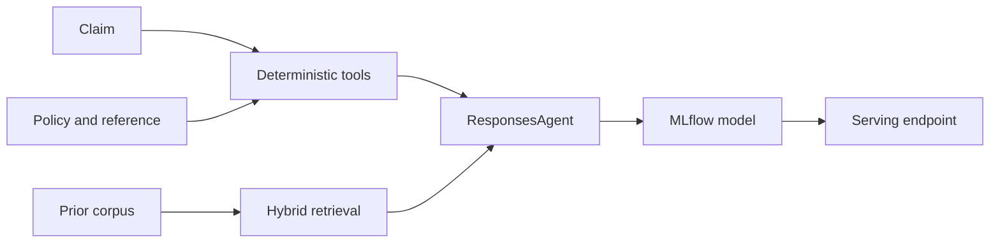

# Agent

## Purpose

Build deterministic claim recommendations with cited policy and precedent, register the MLflow model, and deploy the governed serving endpoint.

## Objects created

Jobs `fe-bar-fraud-graph`, `fe-bar-prior-claims-corpus`, and `fe-bar-deploy-claims-adjudication-agent`; registered model `fe-bar-ir.default.claims_adjudication_agent`; endpoint `agents_fe-bar-ir-default-claims_adjudication_agent`.

## Resources configured

Money authorities remain solely in `src/authorities.py`. `gold.prior_claims_corpus` and synced `reference.prior_claims_corpus` are live at 4,999 rows. Endpoint v1 is still the legacy build that reads `public.prior_claims`; do not claim serving uses the new corpus until the next promoted model is deployed and smoked.

## Data flow


```mermaid
flowchart LR
  C[Claim] --> T[Deterministic tools]
  P[Policy and reference] --> T
  R[Prior corpus] --> Q[Hybrid retrieval]
  T --> A[ResponsesAgent]
  Q --> A --> M[MLflow model] --> E[Serving endpoint]
```

## Deploy

Working directory: `agent/`.

```bash
databricks bundle validate --strict -t prod --profile fe-bar
databricks bundle deploy -t prod --profile fe-bar
```

First-time setup runs fraud graph and corpus construction after the first medallion pass, then creates/resyncs the Lakebase tables. A routine release is human-gated: register, evaluate, promote, then run `deploy_claims_agent`.

## Run

Working directory: `agent/`.

```bash
uv run python src/register_agent.py --profile fe-bar
uv run python ../eval/src/evaluate.py --profile fe-bar --experiment /Shared/claims-adjudication-offline-evaluation --candidate-version N
uv run python ../eval/src/promote.py --profile fe-bar --candidate-version N --promote
databricks bundle run deploy_claims_agent -t prod --profile fe-bar
databricks serving-endpoints query agents_fe-bar-ir-default-claims_adjudication_agent --profile fe-bar --json "$(jq -c '.custom_inputs.persist=false | del(.endpoint)' ../docs/evidence/serving-endpoint/smoke-request.json)"
```

The example forces `custom_inputs.persist=false`, so invocation is read-only.

## Verify

Working directory: `agent/`. Read-only:

```bash
databricks serving-endpoints get agents_fe-bar-ir-default-claims_adjudication_agent --profile fe-bar -o json
databricks model-versions get-by-alias fe-bar-ir.default.claims_adjudication_agent prod --profile fe-bar -o json
databricks model-versions get-by-alias fe-bar-ir.default.claims_adjudication_agent candidate --profile fe-bar -o json
```

Expected now: endpoint `READY`, served entity version `1`, and both aliases resolve to READY version 1. After promotion, expected served version must equal the promoted `@prod` version and the smoke must prove corpus retrieval.

## Status

2026-10-01: repo head builds and reads the live synced corpus. Deployed endpoint v1 is READY but still reads legacy `public.prior_claims`; promotion and endpoint smoke are pending.
