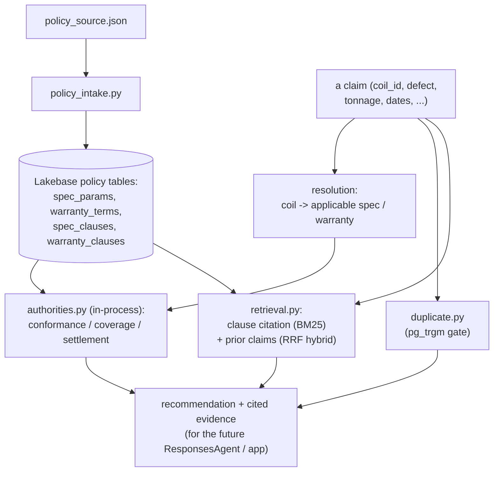

# agent — adjudication agent, deterministic authorities, retrieval, and policy intake

The claims-adjudication agent, the claim-reasoning tools it orchestrates, and the
policy data plane they read. **Deterministic tools decide money; the LLM only
reasons, cites, and recommends** (PLAN §3, §6) — it can never change an authority's
number or verdict. The MLflow 3 `ResponsesAgent` (`src/agent.py`) resolves the
claim once to a frozen policy snapshot, runs the deterministic authorities and the
duplicate gate (which decide eligibility and the amount), gathers advisory context,
calls the governed Unity Gateway model service `system.ai.gpt-5-2` to emit a
structured recommendation, enforces code-level money invariants, and writes an
atomic recommendation + canonical decision record.

## Single source of truth

`../lakebase/src/policy_source.json` is the sole authored policy source. `../lakebase/src/policy_schema.py`
parses it once into two aligned representations ("two representations, one source"):

- **structured params** the authorities read — `spec_params` (grade-level
  chemistry/mechanical ranges, tolerances, coating threshold) and `warranty_terms`
  (product/coating-level duration, full-coverage window, exclusions, proration,
  effective window, freight cap);
- **citable clauses** — `spec_clauses` / `warranty_clauses`, one row per section,
  carrying the metadata and text that hybrid retrieval cites.

The numbers the authorities decide on always come from the params, never the clause
text.

## Objects created

- Native Lakebase policy tables (schema `public`): `spec_params`, `warranty_terms`,
  `spec_clauses`, `warranty_clauses` — created and populated by the intake.
- Fraud-job output: `fe-bar-ir.gold.customer_heat_risk` (Delta CDF enabled so it can
  be served down to Lakebase `reference.customer_heat_risk`).
- Registered model: `fe-bar-ir.default.claims_adjudication_agent`, alias `@prod`.

There are **no** UC functions for the money math. `compute_conformance`,
`compute_coverage`, and `compute_settlement` are pure Python called in-process —
deploying them as UC functions added ~5–6 warehouse round-trips per adjudication for
math that runs in microseconds locally. The append-only decision-record table and
the `adjudications` widening are created by `lakebase/src/setup_and_seed.py`.

## The agent

`src/agent.py` is an MLflow 3 custom `ResponsesAgent` (implements `predict` and
`predict_stream`). Its `UnityGatewayChatModel` adapter in `src/gateway_chat.py`
calls `system.ai.gpt-5-2` through the OpenAI-compatible Unity Gateway chat route.
The LangGraph loop binds the frozen-result tools to that adapter; after the loop,
a separate non-streaming call binds the recommendation JSON Schema through
`response_format`. The decision flow per adjudication:

1. **Resolve-once** — bind the claim's coil to a FROZEN policy snapshot
   (`spec_params`, `warranty_terms`, `freight_cap`, natural-key provenance). Every
   tool reuses that one snapshot (`FrozenAdjudicationContext`), so nothing
   re-resolves per call.
2. **Deterministic authorities + duplicate gate** — conformance, coverage, and
   settlement (`authorities.py`, in-process) plus `check_duplicate_claim`. These
   decide verdict eligibility and the amount, unconditionally, before the LLM sees
   anything.
3. **Advisory context** — `retrieve_policy_clauses` (BM25 citation),
   `find_similar_prior_claims` (hybrid, advisory), `get_customer_heat_risk`.
4. **LLM** — a tool-calling loop reasons over the evidence, then a NON-STREAMING
   `response_format` JSON-Schema call emits a recommendation validated by Pydantic.
5. **Code-level invariants** (`decision_record.enforce_invariants`) — a duplicate is
   never payable (⇒ DENY/DUPLICATE); `approved_amount` equals the settlement
   authority output exactly (else 0 when not APPROVE); the verdict is consistent
   with conformance/coverage eligibility. On any violation the recommendation is
   corrected to the deterministic outcome (the LLM never wins) and the violation is
   recorded.
6. **Persist** — one psycopg transaction writes the recommendation into
   `public.adjudications` AND the canonical row into
   `public.adjudication_decision_records` (atomic, idempotent on
   `(adjudication_id, record_version)`).

Every step is a child span (`TOOL`/`RETRIEVER`/`CHAT_MODEL`) under a root `AGENT`
trace whose searchable attributes carry claim/adjudication id, claim type, the
deterministic verdict + duplicate status, model name/version, authorities git-SHA,
cited clause keys, and the final recommendation — no credentials or PII.

## Retrieval

Two distinct retrieval paths, and only one of them is a semantic/vector search:

- **Clause citation over `spec_clauses` / `warranty_clauses` is metadata-resolved,
  not semantic.** The applicable parent policy is chosen *deterministically* by
  resolution — the spec by `(grade, spec_edition, region)` and the warranty by
  `(product_line, coating_class, region)` plus the effective window at the coil's
  ship date. `retrieve_policy_clauses` (`src/retrieval.py`) then pre-filters clauses
  to that resolved parent on exactly those metadata columns and uses **BM25 only**
  (`clause_tsv <@> to_bm25query(...)` over the `spec_clauses_lb_bm25` /
  `warranty_clauses_lb_bm25` indexes, both using the `lakebase_bm25` method) to *order*
  clauses within it. No embedding is computed for clause citation — the `embed_fn`
  argument is unused on this path. Retrieval only finds and cites the clauses of the
  already-resolved policy; it never decides which policy applies or moves money.
- **Genuine dense-vector + BM25 hybrid (RRF) retrieval lives only in the
  prior-claims precedent corpus.** The corpus is built in the lakehouse by the
  `prior_claims_corpus` job (`src/prior_claims_corpus_job.py` ->
  `gold.prior_claims_corpus`: current claims x latest FINAL adjudication x coil master,
  governed GTE embeddings, change-only MERGE with Delta CDF) and served down to
  Lakebase as the Triggered synced table `reference.prior_claims_corpus`, where
  `lakebase_ann` and `lakebase_bm25` indexes are built on it. Synced tables cannot
  carry `vector`/`tsvector`, so the embedding is a pgvector text literal and the
  indexes cover `embedding::vector(1024)` and `to_tsvector('english',
  defect_narrative)`. `find_similar_prior_claims` runs a dense arm (cosine `<=>`) and
  a BM25 arm (`<@> to_bm25query(...)`) over those expressions, fused by
  reciprocal-rank fusion, and returns `verdict` and `approved_amount` per precedent.
  It is advisory precedent / copy-paste-fraud signal only — the deterministic
  duplicate gate, not this search, is what can deny money. The live serving endpoint
  reads the new table only after the next `register -> evaluate -> promote -> deploy`
  cycle packages this `retrieval.py`.

## Registration

`src/register_agent.py` logs the agent with `mlflow.pyfunc.log_model`
(`python_model="agent.py"` + sibling `code_paths`) and pinned dependencies; it does
not declare passthrough `resources`. It registers the model to
`fe-bar-ir.default.claims_adjudication_agent`, validates the isolated artifact with
`mlflow.models.predict(env_manager="uv")` on a real sample claim (`persist=false` —
validation never writes), and sets `@candidate`. In served mode,
`src/workspace_client.py` authenticates Gateway and Lakebase workspace API calls as
the dedicated application service principal using the deployed secret references;
local runs use the explicit workspace profile. Registration never sets `@prod` —
only `eval/src/promote.py` owns that alias — and does **not** create a serving
endpoint. Traces land in a named, non-Git MLflow experiment.

## Execution model

Two mechanisms only (see the repo-root README). This layer holds the **one
legitimate direct-`uv run python` exception**:

- **`register → evaluate → promote` is the human-gated MLflow model lifecycle**, so
  it runs as direct `uv run python` (`agent/src/register_agent.py`,
  `eval/src/evaluate.py`, `eval/src/promote.py`). It is an interactive operator loop
  — a human reviews the evaluation gate and decides promotion — **not a scheduled
  job**; running it as a bundle job would misrepresent an attended human decision as
  automation, and `evaluate.py` additionally enforces the explicit `fe-bar` profile
  as a money-safety guard.
- **Everything that runs on Databricks compute uses DABs.** `fraud_graph` (builds
  `gold.customer_heat_risk`), `prior_claims_corpus` (builds
  `gold.prior_claims_corpus`), and `deploy_claims_agent` (creates/updates the serving
  endpoint) are `databricks bundle run` jobs. The routine refresh
  (`scripts/refresh.py routine`, see `docs/RUNBOOK.md`) runs `fraud_graph` and
  `prior_claims_corpus` in order and then re-syncs their Lakebase synced tables.

## Release and deployment

Use the `fe-bar` workspace profile for every command. The release order is fixed:

1. `agent/src/register_agent.py` logs and isolated-validates a new model version,
   registers it, and assigns `@candidate`.
2. `eval/src/evaluate.py` evaluates that exact candidate version and records the
   release-gate metrics in MLflow.
3. `eval/src/promote.py --promote` applies the gate and is the only script that
   assigns `@prod`.
4. `agent/src/deploy_agent.py` resolves `@prod` and creates or updates the Model
   Serving endpoint. The `deploy_claims_agent` job in `agent/databricks.yml` runs
   the same script.

Before the first deployment, a workspace administrator must complete these
prerequisites for the application service principal:

1. Create the application service principal and generate a workspace-level OAuth
   secret for it.
2. Grant only the `workspace-access` entitlement. This lets the service principal
   call the workspace API to resolve the Lakebase endpoint and mint a database
   credential; it does not need workspace admin, cluster creation, or SQL access.
3. Create the Lakebase OAuth role for the service principal and grant the
   table-level read/write permissions required by the agent. The role value is the
   application service principal's application UUID.
4. Create the `claims-agent` secret scope and write `app-sp-client-id`,
   `app-sp-client-secret`, and `lakebase-db-user`. Set `lakebase-db-user` to the
   Lakebase OAuth role from step 3: the application service principal's application
   UUID.
5. Grant the service principal `EXECUTE` on
   `system.ai.databricks-gpt-5-2` and `system.ai.gte_large_en_v1_5`.

Run the lifecycle and deployment as follows, replacing `N` with the newly
registered version:

```bash
cd agent
DATABRICKS_CONFIG_PROFILE=fe-bar uv run python src/register_agent.py --profile fe-bar

cd ../eval
DATABRICKS_CONFIG_PROFILE=fe-bar LAKEBASE_PROFILE=fe-bar \
  MLFLOW_GENAI_EVAL_MAX_WORKERS=5 uv run python src/evaluate.py \
  --profile fe-bar --experiment /Shared/claims-adjudication-offline-evaluation \
  --candidate-version N
uv run python src/promote.py --profile fe-bar --candidate-version N --promote

cd ../agent
databricks bundle validate --strict -t prod --profile fe-bar
databricks bundle deploy -t prod --profile fe-bar
databricks bundle run deploy_claims_agent -t prod --profile fe-bar
```

The deployment is idempotent. It serves the `@prod` version at
`agents_fe-bar-ir-default-claims_adjudication_agent` using a Small CPU workload
with scale-to-zero enabled. Wait for both `state.ready == READY` and
`state.config_update == NOT_UPDATING` before invoking it.

Send a claim through the deployed endpoint, with persistence explicitly enabled:

```json
{
  "input": [{"role": "user", "content": "<claim JSON>"}],
  "custom_inputs": {"persist": true, "claim": {"claim_id": "..."}}
}
```

POST this body to
`/serving-endpoints/agents_fe-bar-ir-default-claims_adjudication_agent/invocations`
using workspace authentication. Verify `custom_outputs.llm_used`,
`custom_outputs.write_result.persisted`, and
`custom_outputs.write_result.decision_record_inserted`, then query
`public.adjudications` joined to `public.adjudication_decision_records` by the
returned `adjudication_id`. A successful response proves the request traversed
Lakebase, governed retrieval embedding, governed reasoning, and the atomic write.

## Components

| File | Role |
| --- | --- |
| `src/gateway_chat.py` | LangChain adapter for governed reasoning through the Unity Gateway model service `system.ai.gpt-5-2`; supports bound tools and `response_format` over the OpenAI-compatible chat route with refreshed SDK OAuth authentication. |
| `src/gateway_embed.py` | Shared GTE embedding helper via the Unity Gateway model service `system.ai.gte-large-en`; OAuth token from the SDK, ~16 per batch, 429 retry with backoff, 1024-dim L2-normalized (cosine). Used by both intake and retrieval. |
| `../lakebase/src/policy_intake.py` | Sole creator + populator of the four natural-key policy tables; clause tables carry `tsvector` + `lakebase_bm25` indexes. |
| `src/authorities.py` | Pure `compute_conformance` (incl. gauge + width), `compute_coverage`, `compute_settlement` — the single source of the money math, exercised by the offline tests and called in-process. |
| `src/authorities_runtime.py` | Runtime adapter: fetches params (`public.spec_params` / `warranty_terms`) and coil MTC (`reference.heats_coils` / `mill_test_certs`) over the Lakebase psycopg (5432) path with parameterized queries, then calls the pure authorities in-process. No warehouse on the decision path. |
| `src/duplicate.py` | `check_duplicate_claim` — deterministic record linkage (block by coil + date window, match on defect/amount/tonnage + `pg_trgm` narrative). A gate that can deny money. |
| `src/retrieval.py` | Metadata-filtered BM25 clause citation, plus dense + BM25 reciprocal-rank fusion over the synced `reference.prior_claims_corpus` precedent corpus. Runs at app/agent runtime (psycopg + gateway). |
| `src/prior_claims_corpus.py` + `src/prior_claims_corpus_job.py` | Lakehouse build of `gold.prior_claims_corpus` (FINAL adjudications, governed embeddings reused when narrative + provenance are unchanged, change-only MERGE). Served down as `reference.prior_claims_corpus`. |
| `src/heat_risk.py` | `get_customer_heat_risk(customer_id, heat_no)` — reads the synced-down `reference.customer_heat_risk` graph score. Advisory only; never changes an amount or verdict. |
| `src/agent_tools.py` | Resolve-once decision core + the in-process tool callables (authorities, duplicate, clause/precedent retrieval, risk) and the deterministic baseline recommendation. Pure (no LangGraph/MLflow), unit-tested with a fake connection. |
| `src/decision_record.py` | The money-critical spine: the Pydantic recommendation schema + JSON-Schema, the deterministic outcome, `enforce_invariants` (the LLM never overrides an authority), and the canonical decision-record payload builder. |
| `src/writer.py` | Atomic transactional writer — `adjudications` recommendation + `adjudication_decision_records` canonical row in one transaction, idempotent on `(adjudication_id, record_version)`. |
| `src/agent.py` | The MLflow 3 `ResponsesAgent` orchestrator: LangGraph tool loop and separate structured recommendation through governed `system.ai.gpt-5-2`, MLflow tracing, invariant enforcement, and persistence. |
| `src/register_agent.py` | Log + register + isolated-uv validation + `@candidate` alias. |
| `src/offline_validation.py` | Runs the agent on a labeled sample spanning every injected pattern and captures the evidence (recommendation vs authority, decision records, no override). |
| `src/fraud_graph.py` + `src/fraud_graph_job.py` | Connected-components cluster risk over shared heats, scored by customer concentration, written to `gold.customer_heat_risk`. |
| `src/db.py` | Lakebase psycopg connection using an SDK OAuth credential. |
| `src/workspace_client.py` | Shared workspace client: dedicated application-service-principal OAuth in served mode and the explicit `fe-bar` profile for local runs. |

## Data flow


```mermaid
flowchart TD
  pj["policy_source.json"] --> intake["policy_intake.py"]
  intake --> ptab[("Lakebase policy tables:<br/>spec_params, warranty_terms,<br/>spec_clauses, warranty_clauses")]

  claim["a claim (coil_id, defect,<br/>tonnage, dates, ...)"] --> res["resolution:<br/>coil -> applicable spec / warranty"]
  res --> auth["authorities.py (in-process):<br/>conformance / coverage / settlement"]
  claim --> dup["duplicate.py<br/>(pg_trgm gate)"]
  claim --> ret["retrieval.py:<br/>clause citation (BM25)<br/>+ prior claims (RRF hybrid)"]
  ptab --> auth
  ptab --> ret
  auth --> rec["recommendation + cited evidence<br/>(for the future ResponsesAgent / app)"]
  dup --> rec
  ret --> rec
```

Resolution is deterministic (atomic coil attributes select the applicable
`spec_params` / `warranty_terms` row); the authorities compute the money math on
those params; duplicate detection and retrieval add gates and citable evidence. The
outputs are assembled into a recommendation for the (planned) orchestrator and
adjuster app — no component here decides money using LLM output.

## Run

Intake and retrieval run as local runtime Python (psycopg 5432 + gateway HTTPS),
always with an explicit profile:

```bash
uv run --with "psycopg[binary]==3.2.10" --with "databricks-sdk>=0.81.0" \
  python lakebase/src/policy_intake.py --profile fe-bar       # idempotent; owns the 4 tables
databricks bundle run fraud_graph -t prod --profile fe-bar          # gold.customer_heat_risk
databricks bundle run prior_claims_corpus -t prod --profile fe-bar  # gold.prior_claims_corpus
```

On a fresh workspace `fraud_graph` runs once before the first medallion refresh: with
no `gold.claims_current` yet it publishes an empty, typed `gold.customer_heat_risk`
so the gold fact can build, then exits (see `docs/RUNBOOK.md`).

## Development checks

```bash
# Reuse the eval project's MLflow/runtime dependencies for agent imports.
uv run --project eval pytest agent/tests -q
uv run --with ruff ruff check agent && uv run --with ruff ruff format --check agent
python3 -m compileall -q agent/src
```

Unit tests cover the authorities against the injected label patterns
(in-spec-should-deny, genuine nonconformance, adhesion failure, out-of-warranty /
environment exclusions, over-claim capping + partials, warranty proration), the
duplicate rule, RRF fusion + metadata filters, the embedding helper
(normalization/batching/429 retry), and the fraud-graph clustering.
