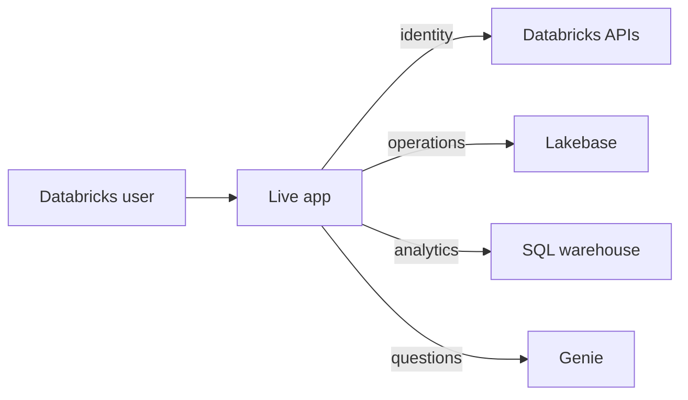

# App

## Purpose

The live app is the human review and analytics interface. Adjusters review queued recommendations, drill through cited policy, source records, risk, and precedent, then finalize decisions. Business users see claims history, governed analytics, and Genie. Multi-role callers can switch persona; the switch changes presentation, never authorization.

Authentication deliberately splits by data plane. Operational Lakebase reads and finalization writes use the App-SP through the platform-injected pool. OBO (on-behalf-of-user) identity is used for SCIM role resolution and governed Genie and SQL warehouse surfaces. The OBO email is recorded as `decided_by`; the client persona never selects the authorization identity.

## Objects created

- App `steel-claims-cockpit`.
- Screens: Adjuster Queue, Claim Cockpit, Claims History, Business Dashboard, and Genie assistants.
- Read-only drill-through from Claim Cockpit to policy clauses, prior claims, and customer heat risk.

## Resources configured

The bundle attaches SQL warehouse `38e458a09de4a055`, two Genie spaces, and the production Lakebase database. Server-side authorization derives a role set from Databricks groups. `GET /api/whoami` returns identity, all roles, and the default role.

Role resolution is allowlist override → OBO group lookup → deny. SCIM failures deny access; the OBO token is never cached. Lakebase never falls back to a developer profile: App-SP ownership and grants govern operational access.

| Endpoint | Access |
| --- | --- |
| `GET /api/whoami` | Either role |
| `GET /api/queue`, `GET /api/claims/:id`, `GET /api/source/:source/:id` | Adjuster |
| `POST /api/claims/:id/finalize` | Adjuster |
| `GET /api/history`, `/api/genie/history/*` | Either role |
| `/api/genie/cockpit/*` | Adjuster |
| `/api/genie/business/*`, `/api/analytics/*`, `GET /api/business/dashboard` | Business user |

Unknown API routes fail closed.

## Data flow



## Deploy

Working directory: `app/`.

```bash
databricks bundle validate --strict -t default --profile fe-bar
databricks bundle deploy -t default --profile fe-bar
databricks bundle run app -t default --profile fe-bar
```

## Run

The deployed app starts automatically. Redeploy after an app change with the Deploy sequence.

## Verify

Working directory: `app/`. These commands are read-only.

```bash
databricks apps get steel-claims-cockpit --profile fe-bar -o json
curl -fsS -H "Authorization: Bearer $DATABRICKS_TOKEN" \
  "https://steel-claims-cockpit-7474655183924919.aws.databricksapps.com/api/whoami"
```

Verify the app is `RUNNING`, deployment is `SUCCEEDED`, `/api/whoami` returns the expected role set, each persona exposes only allowed screens, and adjuster drill-through opens the correct record. The curl requires a user token; never commit it.

## Status

As of 2026-10-01, repo head describes the full UI and the app is live. Persona screenshots and a fresh authenticated whoami capture remain [pending](../docs/evidence/current-state/pending.md).
