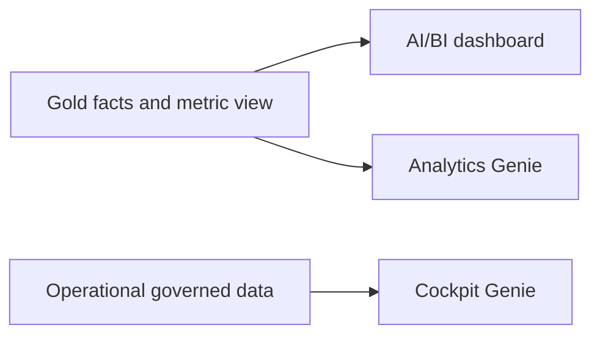

# Dashboards and Genie

## Purpose

Provide governed quality analytics and natural-language access to operational and gold data.

## Objects created

AI/BI dashboard `Steel Quality Claims Analytics` and Genie spaces `Steel Claims Operational Cockpit` and `Steel Quality Claims Analytics`.

## Resources configured

Dashboard ID `01f1bac220111001a171872b5185e8e6`; operational Genie ID `01f1bb5b9d081378b00a283760825c64`; analytics Genie ID `01f1bac20bf6119f84fa99c7ba438ba4`; warehouse `38e458a09de4a055`.

Obtain IDs with `databricks lakeview list` and `databricks genie list-spaces`. If a space is recreated, edit `quality_claims.lvdash.json` `uiSettings.genieSpace.overrideId`, validate, and redeploy the dashboard bundle.

## Data flow



## Deploy

Working directory: `dashboards/`.

```bash
databricks bundle validate --strict -t prod --profile fe-bar
databricks bundle deploy -t prod --profile fe-bar
```

## Run

Dashboards and Genie run on read. After an override-ID edit, repeat both Deploy commands; bundle validation alone does not update the deployed dashboard.

## Verify

Working directory: `dashboards/`. Read-only:

```bash
databricks lakeview list --profile fe-bar -o json
databricks lakeview get 01f1bac220111001a171872b5185e8e6 --profile fe-bar -o json
databricks genie get-space 01f1bb5b9d081378b00a283760825c64 --profile fe-bar -o json
databricks genie get-space 01f1bac20bf6119f84fa99c7ba438ba4 --profile fe-bar -o json
```

Expected: dashboard lifecycle `ACTIVE`; both spaces return the titles above and warehouse `38e458a09de4a055`.

Development check from `dashboards/`: `jq empty quality_claims.lvdash.json genie/genie_space.json`.

## Status

2026-10-01: definitions at repo head match one ACTIVE deployed dashboard and two live Genie spaces on `fe-bar`.
