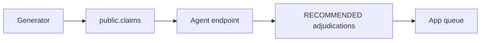

# Demo backlog

## Purpose

Create deterministic synthetic claims and persisted RECOMMENDED adjudications for the adjuster queue.

## Objects created

Job `steel-claims-demo-backlog`; Lakebase rows tagged `synthetic_demo_backlog`. It creates no finalized outbox event.

## Resources configured

Parameters: `count` (500), `seed` (42), `mode` (`serving_endpoint`), Lakebase endpoint and database.

## Data flow



## Deploy

Working directory: `demo/`.

```bash
databricks bundle validate --strict -t prod --profile fe-bar
databricks bundle deploy -t prod --profile fe-bar
```

## Run

Working directory: `demo/`. CLI 1.17 job parameters use `--params`:

```bash
databricks bundle run demo_backlog -t prod --profile fe-bar --params count=1000,seed=123,mode=serving_endpoint
```

Cleanup is destructive and Lakebase-only; use fully qualified names and a transaction:

```sql
BEGIN;
DELETE FROM public.adjudications WHERE claim_id IN (SELECT claim_id FROM public.claims WHERE data_provenance='synthetic_demo_backlog');
DELETE FROM public.claims WHERE data_provenance='synthetic_demo_backlog';
COMMIT;
```

## Verify

Working directory: `demo/`. Read-only:

```bash
databricks jobs list --profile fe-bar -o json
```

Expected: `steel-claims-demo-backlog` is listed. A completed run returns a JSON summary; any sample summary in documentation is illustrative, not live evidence.

## Status

2026-10-01: job exists in repo head and is deployed on `fe-bar`. A new demo backlog run was not executed for this documentation change and remains pending.
