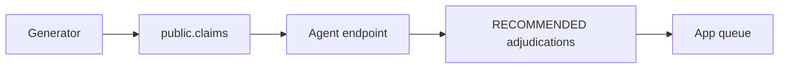

# Demo backlog

## Purpose

Create deterministic synthetic claims and persisted RECOMMENDED adjudications for the adjuster queue.

## Objects created

Job `steel-claims-demo-backlog`; Lakebase rows tagged `synthetic_demo_backlog`. It creates no finalized outbox event.

## Resources configured

Parameters: `count` (500), `seed` (42), `mode` (`serving_endpoint`), Lakebase endpoint and database. Keep `count >= 100` so every injected label pattern is represented.

## Data flow



## Deploy

Working directory: `demo/`.

```bash
databricks bundle validate --strict -t prod --profile fe-bar
databricks bundle deploy -t prod --profile fe-bar
```

## Run

Working directory: repository root. The composer runs `demo_backlog` once and then the routine refresh:

```bash
uv run --with pyyaml python scripts/refresh.py demo
```

The job default is 500 claims. If invoking the bundle job directly for a custom count, CLI 1.17 uses `--params`; follow that one job run with `scripts/refresh.py routine`, not `scripts/refresh.py demo`.

Connect with `databricks psql --project fe-bar-operational-plane --profile fe-bar -- -d databricks_postgres`. Cleanup is destructive and Lakebase-only; use fully qualified names and a transaction:

```sql
BEGIN;
DELETE FROM public.adjudication_decision_records WHERE adjudication_id IN (
  SELECT adjudication_id FROM public.adjudications WHERE claim_id IN (
    SELECT claim_id FROM public.claims WHERE data_provenance='synthetic_demo_backlog'
  )
);
DELETE FROM public.adjudications WHERE claim_id IN (SELECT claim_id FROM public.claims WHERE data_provenance='synthetic_demo_backlog');
DELETE FROM public.claims WHERE data_provenance='synthetic_demo_backlog';
COMMIT;
```

## Verify

Working directory: `demo/`. Read-only:

```bash
databricks jobs list --profile fe-bar -o json
```

Expected: `steel-claims-demo-backlog` is listed. A completed run returns a JSON summary; any sample summary in documentation is illustrative, not live evidence.

Development checks from the repository root: `uv run --project eval pytest demo/tests -q && uv run --with ruff ruff check demo`.

## Status

2026-10-01: job exists in repo head and is deployed on `fe-bar`. A new demo backlog run was not executed for this documentation change and remains pending.
