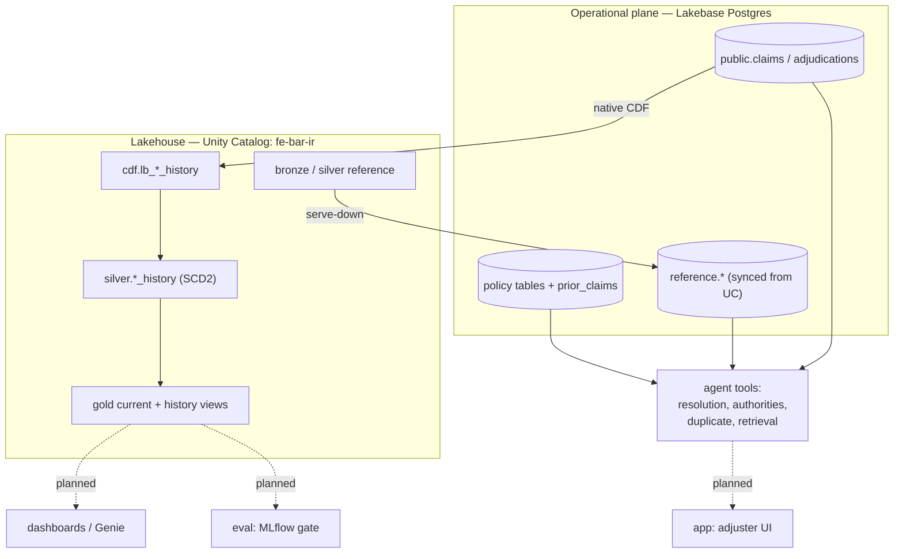

# docs

Project documentation and committed execution evidence.

This repository is a reference implementation of a steel claims-adjudication agent.
Claims are born in a Lakebase (Postgres) operational plane; governed reference and
policy data moves between Lakebase and Unity Catalog; deterministic tools decide
money while retrieval finds citable evidence; and the claim/adjudication history is
maintained incrementally in the lakehouse via native Change Data Feed (CDF).

## Architecture

## Layers

| Directory | What it does | Status |
| --- | --- | --- |
| `pipelines/` | Synthetic data, medallion pipeline, CDF SCD2 history, governance | Built |
| `lakebase/` | Operational Postgres plane, serve-down, native tables, CDF | Built |
| `agent/` | Policy intake, deterministic authorities, retrieval, duplicate, fraud graph | Built (tools; orchestrating agent pending) |
| `app/` | Adjuster review UI (Databricks App) | Planned |
| `dashboards/` | AI/BI dashboards + Genie over gold KPIs | Planned |
| `eval/` | MLflow evaluation harness + CI threshold gate | Planned |
| `services/` | Kafka worker, outbox relay, downstream consumers | Planned |

## Evidence

Committed execution evidence lives under `docs/evidence/`, one folder per
workstream, each captured live against the `fe-bar` profile. Every folder has a
README indexing its files and what they demonstrate.

| Folder | Covers |
| --- | --- |
| `synthetic-data/` | Dataset generation, governance grants/masks, integrity checks, samples |
| `lakebase-serve-down/` | Lakebase provisioning and Triggered serve-down parity |
| `policy-intake-and-retrieval/` | Policy intake, resolution, in-process authorities, retrieval |
| `cdf-incremental-history/` | Native CDF SCD Type 2 cutover and incremental proof |
