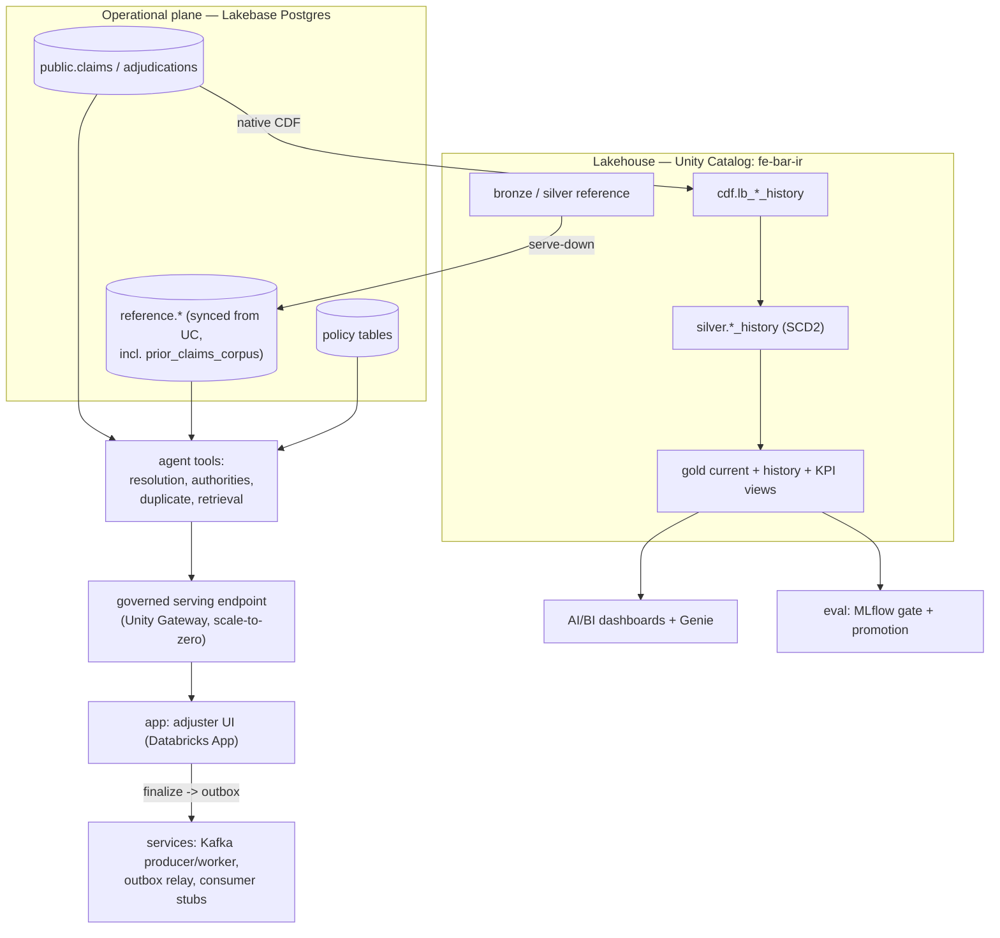

# docs

Project documentation and committed execution evidence.

This repository is a reference implementation of a steel claims-adjudication agent.
Claims are born in a Lakebase (Postgres) operational plane; governed reference and
policy data moves between Lakebase and Unity Catalog; deterministic tools decide
money while retrieval finds citable evidence; the claim/adjudication history is
maintained incrementally in the lakehouse via native Change Data Feed (CDF); and
the agent is registered and deployed as a governed serving endpoint with an
offline evaluation gate over its traces.

**Operating the system:** see [`RUNBOOK.md`](RUNBOOK.md) for every pipeline, job,
app, dashboard, and synced table with its trigger, and for the run orders (core data
bootstrap, routine refresh, demo refresh, schema change, event backbone) and when a
full refresh is required. See [`CURRENT-STATE.md`](CURRENT-STATE.md) for what is
verified live versus proven in code and tests.

> All data in this repository is synthetic; it is a proof of concept, not production.

## Architecture

```mermaid
flowchart TB
  subgraph OLTP["Operational plane — Lakebase Postgres"]
    claims[("public.claims / adjudications")]
    policy[("policy tables")]
    ref[("reference.* (synced from UC,<br/>incl. prior_claims_corpus)")]
  end
  subgraph LH["Lakehouse — Unity Catalog: fe-bar-ir"]
    refsrc["bronze / silver reference"]
    cdfland["cdf.lb_*_history"]
    silverh["silver.*_history (SCD2)"]
    gold["gold current + history + KPI views"]
  end
  agent["agent tools:<br/>resolution, authorities,<br/>duplicate, retrieval"]
  endpoint["governed serving endpoint<br/>(Unity Gateway, scale-to-zero)"]

  refsrc -- "serve-down" --> ref
  claims -- "native CDF" --> cdfland --> silverh --> gold
  policy --> agent
  ref --> agent
  claims --> agent
  agent --> endpoint
  gold --> dash["AI/BI dashboards + Genie"]
  gold --> evalx["eval: MLflow gate + promotion"]
  endpoint --> app["app: adjuster UI (Databricks App)"]
  app -- "finalize -> outbox" --> svc["services: Kafka producer/worker,<br/>outbox relay, consumer stubs"]
```

## Layers

| Directory | What it does | Status |
| --- | --- | --- |
| `pipelines/` | Synthetic data, medallion pipeline, CDF SCD2 history, governance | Built |
| `lakebase/` | Operational Postgres plane, serve-down, native policy tables, CDF | Built |
| `agent/` | Policy intake, deterministic authorities, retrieval, duplicate, fraud graph; the orchestrating ResponsesAgent, registered and deployed as a governed serving endpoint | Built |
| `eval/` | MLflow evaluation harness + versioned candidate→prod promotion gate | Built |
| `dashboards/` | AI/BI dashboard + Genie space over gold KPIs | Built |
| `app/` | Adjuster review-and-finalize UI (Databricks App), four screens | Built |
| `services/` | Kafka event backbone, adjudication worker, outbox relay, downstream consumer stubs | Built |

All layers are implemented (code-complete). For what is additionally verified live in
the current workspace versus proven only in code and tests, see
[`CURRENT-STATE.md`](CURRENT-STATE.md).

## Design decisions

Intentional deviations from the initial plan, kept here so the repository reads accurately:

- **Deterministic authorities run in-process, not as UC Python functions.** The money math lives in a single source (`agent/src/authorities.py`), exercised by tests and imported directly by the agent runtime. UC function registration was removed to eliminate deployed-vs-tested drift and to keep the adjudication path off a SQL warehouse (sub-millisecond, no cold start).
- **Serve-down set: six reference tables plus the precedent corpus.** `spec_standards` and `coating_warranty_terms` were dropped from serve-down — policy data now lives in native Lakebase tables (`spec_params`, `spec_clauses`, `warranty_terms`, `warranty_clauses`) that the agent reads directly — and `customer_heat_risk` was added for the agent's advisory heat-risk tool.
- **The prior-claims precedent corpus is lakehouse-built and served down.** The agent `prior_claims_corpus` job builds `gold.prior_claims_corpus` from gold current claims and FINAL adjudications (governed GTE embeddings, change-only MERGE with Delta CDF); it is served down as the Triggered synced table `reference.prior_claims_corpus` with `lakebase_ann` / `lakebase_bm25` indexes, and refreshed by `scripts/refresh.py routine`. It replaced the native `public.prior_claims` table and its embed-once backfill.
- **`claims_pending` removed.** The retry-queue placeholder had no consumer; it is retired with the event-backbone (services) work.

## Evidence

Committed execution evidence lives under `docs/evidence/`, one folder per area.
**All evidence is from synthetic demo runs**, captured at a point in time (the commit
noted in each set) — it is not production data or continuous monitoring. Each folder
has a README indexing its files and what they demonstrate. For the consolidated
current-state and verification summary, see [`CURRENT-STATE.md`](CURRENT-STATE.md).

| Folder | Covers |
| --- | --- |
| `synthetic-data/` | Dataset generation, governance grants/masks, integrity checks, samples |
| `lakebase-serve-down/` | Lakebase provisioning and Triggered serve-down parity |
| `policy-intake-and-retrieval/` | Policy intake, resolution, in-process authorities, retrieval |
| `cdf-incremental-history/` | Native CDF SCD Type 2 history and incremental proof |
| `claims-adjudication-agent/` | ResponsesAgent build, money-safety invariant enforcement, decision records |
| `gold-analytics/` | Gold KPI fact layer + governed metric view |
| `ablation-eval/` | Deterministic-rules vs. agent comparison — where reasoning adds measurable value |

Earlier iteration-workstream evidence and deployment-event captures from a retired
workspace have been removed to keep this set current and self-consistent.
