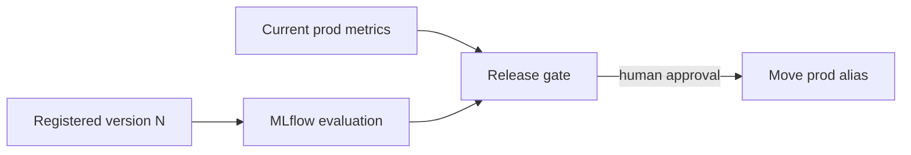

# Evaluation

## Purpose

Evaluate an exact registered-model version, compare it with production, and gate alias promotion without moving aliases during evaluation.

## Objects created

MLflow evaluation dataset, traces, runs under `/Shared/claims-adjudication-offline-evaluation`, release metrics, and model aliases `@candidate` and `@prod`.

## Resources configured

Evaluation loads `models:/fe-bar-ir.default.claims_adjudication_agent/N`. Money-safety metrics must pass absolute thresholds; outcome metrics must not regress versus `@prod`.

## Data flow



## Deploy

There is no eval bundle. Working directory: `agent/` for registration; `eval/` for evaluation and promotion.

```bash
cd agent
uv run python src/register_agent.py --profile fe-bar
```

## Run

Working directory: `eval/`. Find `N` first, then evaluate and promote:

```bash
databricks model-versions get-by-alias fe-bar-ir.default.claims_adjudication_agent candidate --profile fe-bar -o json
uv run python src/evaluate.py --profile fe-bar --experiment /Shared/claims-adjudication-offline-evaluation --candidate-version N
uv run python src/promote.py --profile fe-bar --candidate-version N
uv run python src/promote.py --profile fe-bar --candidate-version N --promote
```

The first promote command is a dry run.

## Verify

Working directory: `eval/`. Read-only:

```bash
databricks model-versions get-by-alias fe-bar-ir.default.claims_adjudication_agent candidate --profile fe-bar -o json
databricks model-versions get-by-alias fe-bar-ir.default.claims_adjudication_agent prod --profile fe-bar -o json
uv run python -c 'import mlflow; mlflow.set_tracking_uri("databricks://fe-bar"); e=mlflow.get_experiment_by_name("/Shared/claims-adjudication-offline-evaluation"); print(mlflow.search_runs([e.experiment_id], order_by=["start_time DESC"], max_results=5)[["run_id","status","tags.candidate_version"]].to_string(index=False))'
```

Expected: aliases resolve to explicit READY versions; the latest relevant MLflow run is `FINISHED` and its `candidate_version` equals `N`.

## Status

2026-10-01: repo head contains the direct human-gated workflow; no eval bundle job is current. On `fe-bar`, both `@candidate` and `@prod` resolve to version 1.
