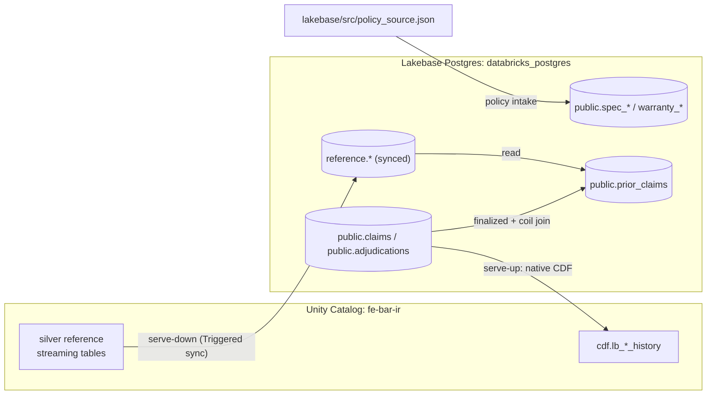

# lakebase — operational Postgres plane

Provisions and seeds the Lakebase Autoscaling operational plane (Postgres), holds
the native OLTP, policy, and search tables the app and agent read at runtime, and
configures the two directions of data movement between Unity Catalog and Lakebase:
reference data served **down** into Postgres, and claims/adjudications changes
served **up** into the lakehouse via native CDF.

The project runs PostgreSQL 17 on a 0.5 CU endpoint that suspends after idle. No
database password or token is stored in the repo — the setup job mints a
short-lived OAuth credential at runtime.

## Objects created

Infrastructure (Lakebase Autoscaling):

- Project `fe-bar-operational-plane` -> branch `production` -> endpoint `primary`
  -> database `databricks_postgres` (PostgreSQL 17, 0.5 CU, suspend after 300s).
- Unity Catalog read-only mirror catalog: `fe_bar_operational`.

Native Postgres tables in schema `public`:

| Group | Tables | Notes |
| --- | --- | --- |
| Operational (OLTP) | `claims`, `adjudications`, `outbox`, `settlements`, `investigation_cases`, `supplier_recovery_cases` | Primary key + `REPLICA IDENTITY FULL` (CDF prerequisite). The pending/retry queue is deferred to the future services wave. |
| Decision record (created by `src/setup_and_seed.py`) | `adjudication_decision_records` | Append-only canonical record per adjudication, PK `(adjudication_id, record_version)`, JSONB payload, `REPLICA IDENTITY FULL`; UPDATE/DELETE revoked (immutability by access) |
| Precedent corpus | `prior_claims` | Finalized claims joined to adjudications + coil; embeddings + full-text |
| Policy (created by `agent/` intake) | `spec_params`, `spec_clauses`, `warranty_terms`, `warranty_clauses` | Natural-key policy params + citable clauses |

Extensions: `pg_trgm`, `vector` (pgvector), `lakebase_vector`, `lakebase_text`.

Search / match indexes:

| Index | Table | Method |
| --- | --- | --- |
| `prior_claims_lb_ann` | `prior_claims` | `lakebase_ann` (vector) |
| `prior_claims_lb_bm25` | `prior_claims` | `lakebase_bm25` (lexical) |
| `spec_clauses_lb_bm25` | `spec_clauses` | `lakebase_bm25` |
| `warranty_clauses_lb_bm25` | `warranty_clauses` | `lakebase_bm25` |
| `claims_defect_narrative_trgm` | `claims` | GIN / `pg_trgm` |

Synced tables (Unity Catalog reference data served down), schema `reference` — six:
`heats_coils`, `mill_test_certs`, `customers`, `suppliers`, `defect_codes`, and
`customer_heat_risk` (Triggered, sourced from `gold.customer_heat_risk` with
composite key `(customer_id, heat_no)`; requires Delta CDF on the source, which the
fraud-graph job now sets). The agent's `get_customer_heat_risk` tool reads it —
advisory only.

Native CDF: one schema-scoped config over `public` -> Unity Catalog schema
`fe-bar-ir.cdf`, landing `lb_claims_history` and `lb_adjudications_history`.

Secret scope `fe-bar-lakebase` — keys `database`, `endpoint`, `host`, `port`,
`user` (no stored password/token).

## Resources configured

- Bundle `fe-bar-lakebase`; job `fe-bar-lakebase-setup-and-seed`; target `prod`,
  profile `fe-bar`; serverless job environment with `databricks-sdk` and
  `psycopg[binary]`.
- Synced tables use Triggered mode (`scripts/create_synced_tables.sh`, via the
  `databricks postgres create-synced-table` surface).
- The one-time seed tags every synthetic row with
  `data_provenance = 'synthetic_wave_2_baseline'` and is idempotent; it must not be
  rerun after CDF is active (use `pipelines/run.py run` for the guarded sequence).

## Data flow



- **Serve-down:** UC silver reference tables sync into Lakebase `reference.*`, so
  the agent and app read reference data transactionally.
- **Serve-up:** changes to `public.claims` / `public.adjudications` flow up through
  native CDF into `fe-bar-ir.cdf.lb_*_history` (then AUTO CDC SCD2 in `pipelines/`).
- **Policy / precedent:** the policy tables are populated by the `agent/` intake;
  `prior_claims` is built from finalized claims + adjudications + coil reference for
  hybrid precedent search.

### A note on the CDF "Error"/skipped tables

Native Lakebase CDF is **schema-scoped**: the config captures every table in
`public`, and there is no per-table include/exclude. The seven operational tables
were given `REPLICA IDENTITY FULL` and stream normally. The policy and precedent
tables (`spec_params`, `spec_clauses`, `warranty_terms`, `warranty_clauses`,
`prior_claims`) are **intentionally not part of the CDF write-model** — they are
reference/search data, not transactional history — so they are not given
`REPLICA IDENTITY FULL` and the connector skips them (surfaced as "Error"/skipped
in the CDF UI). This is expected: those tables are populated directly (policy
intake / precedent build), not fed up through CDF. Three of them also carry
`vector`/`tsvector` columns that CDF cannot serialize. Do not add
`REPLICA IDENTITY FULL` to them — that would opt them into CDF, which is the
opposite of intent.

Conversely, `adjudication_decision_records` **is** given `REPLICA IDENTITY FULL`
(and carries only JSONB/scalar columns, no `vector`/`tsvector`), so the same
schema-scoped config streams it. A schema-scoped config detects a newly added table
once it has committed WAL activity; the first decision-record write is what moves it
to `CDF_STATE_STREAMING` and materializes `cdf.lb_adjudication_decision_records_history`.

## Deploy and execute on the workspace

```bash
uv run --with pyyaml python lakebase/run.py validate
uv run --with pyyaml python lakebase/run.py deploy
uv run --with pyyaml python lakebase/run.py setup-and-seed
uv run --with pyyaml python lakebase/run.py policy-intake
uv run --with pyyaml python lakebase/run.py create-cdf
uv run --with pyyaml python lakebase/run.py synced-tables
```

The wrappers always use `-t prod --profile fe-bar`. The underlying bundle job key
is `setup_and_seed`; `lakebase/scripts/create_synced_tables.sh` is the direct
alternative to the `synced-tables` action. The setup action refuses before deploy
or seed if native CDF already exists.
The pending/retry queue remains a future services-wave responsibility.
