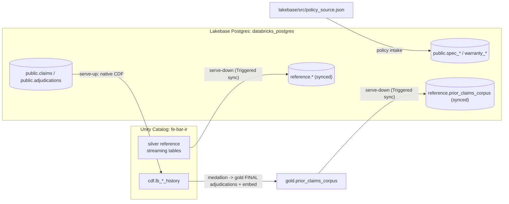

# lakebase — operational Postgres plane

Provisions and seeds the Lakebase Autoscaling operational plane (Postgres), holds
the native OLTP, policy, and search tables the app and agent read at runtime, and
configures the two directions of data movement between Unity Catalog and Lakebase:
reference data served **down** into Postgres, and claims/adjudications changes
served **up** into the lakehouse via native CDF.

The project runs PostgreSQL 17 on a 0.5 CU endpoint that suspends after idle. No
database password or token is stored in the repo — the setup job mints a
short-lived OAuth credential at runtime.

## Objects created

Infrastructure (Lakebase Autoscaling):

- Project `fe-bar-operational-plane` -> branch `production` -> endpoint `primary`
  -> database `databricks_postgres` (PostgreSQL 17, 0.5 CU, suspend after 300s).
- Unity Catalog read-only mirror catalog: `fe_bar_operational`.

Native Postgres tables in schema `public`:

| Group | Tables | Notes |
| --- | --- | --- |
| Operational (OLTP) | `claims`, `adjudications`, `outbox`, `settlements`, `investigation_cases`, `supplier_recovery_cases` | Primary key + `REPLICA IDENTITY FULL` (CDF prerequisite). The pending/retry queue is deferred to the future services wave. |
| Decision record (created by `src/setup_and_seed.py`) | `adjudication_decision_records` | Append-only canonical record per adjudication, PK `(adjudication_id, record_version)`, JSONB payload, `REPLICA IDENTITY FULL`; UPDATE/DELETE revoked (immutability by access) |
| Policy (created by `agent/` intake) | `spec_params`, `spec_clauses`, `warranty_terms`, `warranty_clauses` | Natural-key policy params + citable clauses |

Extensions: `pg_trgm`, `vector` (pgvector), `lakebase_vector`, `lakebase_text`.

Search / match indexes:

| Index | Table | Method |
| --- | --- | --- |
| `prior_claims_corpus_lb_ann` | `reference.prior_claims_corpus` (synced) | `lakebase_ann` over `embedding::vector(1024)` |
| `prior_claims_corpus_lb_bm25` | `reference.prior_claims_corpus` (synced) | `lakebase_bm25` over `to_tsvector('english', defect_narrative)` |
| `spec_clauses_lb_bm25` | `spec_clauses` | `lakebase_bm25` |
| `warranty_clauses_lb_bm25` | `warranty_clauses` | `lakebase_bm25` |
| `claims_defect_narrative_trgm` | `claims` | GIN / `pg_trgm` |

Synced tables (Unity Catalog data served down, all Triggered), schema `reference` —
seven: `heats_coils`, `mill_test_certs`, `customers`, `suppliers`, `defect_codes`,
`customer_heat_risk` (from `gold.customer_heat_risk`, composite key
`(customer_id, heat_no)`; the agent's `get_customer_heat_risk` tool reads it —
advisory only), and `prior_claims_corpus` (from `gold.prior_claims_corpus`, key
`claim_id`; the lakehouse-built precedent corpus that replaced the native
`public.prior_claims` table). Both gold sources set Delta CDF, which Triggered mode
requires. Synced tables are read-only in Postgres except for indexes, so the corpus
stores its embedding as a pgvector text literal and the `lakebase_ann` /
`lakebase_bm25` indexes are expression indexes built by `scripts/synced_tables.py`.

Native CDF: one schema-scoped config over `public` -> Unity Catalog schema
`fe-bar-ir.cdf`, landing `lb_claims_history` and `lb_adjudications_history`.

Secret scope `fe-bar-lakebase` — keys `database`, `endpoint`, `host`, `port`,
`user` (no stored password/token).

## Resources configured

- Bundle `fe-bar-lakebase`; job `fe-bar-lakebase-setup-and-seed`; target `prod`,
  profile `fe-bar`; serverless job environment with `databricks-sdk` and
  `psycopg[binary]`.
- Synced tables use Triggered mode and are managed by `scripts/synced_tables.py`
  (via the `databricks postgres create-synced-table` surface), which has three paths
  with different grant behavior:
  - **create** (`run.py synced-tables`): creates only the missing tables, then waits
    for each new one to reach `SYNCED_TABLE_ONLINE*` (the Postgres table exists only
    after the initial sync; a FAILED state or a one-hour timeout stops the run). Only
    then does it build the corpus indexes on a new corpus table and — only if it
    created something — run `scripts/regrant_synced_table_selects.py`.
  - **re-sync** (`run.py resync-synced-tables`): the routine path. It runs an
    incremental update of each existing table's managed sync pipeline
    (`status.pipeline_id` from `get-synced-table`, then `databricks pipelines
    start-update`, the same operation as the Catalog "Sync now" button) and waits for
    it to complete. The Postgres table, its owner, grants, and indexes are kept, so
    this path never re-grants. For the corpus it then re-ensures the indexes and runs
    `VACUUM (ANALYZE)` so the BM25 statistics include the new rows.
  - **recreate** (`run.py recreate-synced-table --table <t>`): the schema-change
    path only. Delete + drop + create makes the table owned by a different role and
    drops its grants, so after the same ONLINE wait it rebuilds indexes and re-grants.
  The re-grant applies `SELECT` on the `reference.*` synced tables to the documented
  consumers — the app SP (`docs/evidence/app-deploy/grants.sql`) and the serving SP
  (`docs/evidence/serving-endpoint/README.md`) — so a create/recreate is reproducible
  without a manual `GRANT` (the app-SP losing SELECT on `reference.customer_heat_risk`
  500'd the cockpit on the go-live run). Override the SP ids via `APP_SP_PRINCIPAL` /
  `SERVING_SP_PRINCIPAL` if they are rotated.
- The one-time seed tags every synthetic row with
  `data_provenance = 'synthetic_wave_2_baseline'` and is idempotent; it must not be
  rerun after CDF is active (use `scripts/bootstrap.py`, or `lakebase/run.py
  setup-and-seed`, for the guarded sequence).

## Data flow


```mermaid
flowchart LR
  subgraph UC["Unity Catalog: fe-bar-ir"]
    silverref["silver reference<br/>streaming tables"]
    cdfland["cdf.lb_*_history"]
  end
  subgraph LB["Lakebase Postgres: databricks_postgres"]
    ref[("reference.* (synced)")]
    oltp[("public.claims / public.adjudications")]
    policy[("public.spec_* / warranty_*")]
    prior[("reference.prior_claims_corpus (synced)")]
  end
  goldcorpus["gold.prior_claims_corpus"]

  silverref -- "serve-down (Triggered sync)" --> ref
  oltp -- "serve-up: native CDF" --> cdfland
  policyjson["lakebase/src/policy_source.json"] -- "policy intake" --> policy
  cdfland -- "medallion -> gold FINAL adjudications + embed" --> goldcorpus
  goldcorpus -- "serve-down (Triggered sync)" --> prior
```

- **Serve-down:** UC silver reference tables sync into Lakebase `reference.*`, so
  the agent and app read reference data transactionally.
- **Serve-up:** changes to `public.claims` / `public.adjudications` flow up through
  native CDF into `fe-bar-ir.cdf.lb_*_history` (then AUTO CDC SCD2 in `pipelines/`).
- **Policy / precedent:** the policy tables are populated by the policy intake. The
  precedent corpus is built in the lakehouse by the `agent/` `prior_claims_corpus` job
  from gold current claims + FINAL adjudications + the coil master, then served down
  as `reference.prior_claims_corpus` for hybrid precedent search.

### A note on the CDF "Error"/skipped tables

Native Lakebase CDF is **schema-scoped**: the config captures every table in
`public`, and there is no per-table include/exclude. The seven operational tables
were given `REPLICA IDENTITY FULL` and stream normally. The policy tables
(`spec_params`, `spec_clauses`, `warranty_terms`, `warranty_clauses`) are
**intentionally not part of the CDF write-model** — they are reference/search data,
not transactional history — so they are not given `REPLICA IDENTITY FULL` and the
connector skips them (surfaced as "Error"/skipped in the CDF UI). This is expected:
those tables are populated directly by the policy intake, not fed up through CDF.
Two of them also carry `tsvector` columns that CDF cannot serialize. Do not add
`REPLICA IDENTITY FULL` to them — that would opt them into CDF, which is the
opposite of intent.

Conversely, `adjudication_decision_records` **is** given `REPLICA IDENTITY FULL`
(and carries only JSONB/scalar columns, no `vector`/`tsvector`), so the same
schema-scoped config streams it. A schema-scoped config detects a newly added table
once it has committed WAL activity; the first decision-record write is what moves it
to `CDF_STATE_STREAMING` and materializes `cdf.lb_adjudication_decision_records_history`.

## Execution model

Two mechanisms only (see the repo-root README). The `lakebase` `run.py` wrapper
exposes only actions that add guarded orchestration around `bundle run` or run a
non-bundle step:

- **`setup-and-seed`** refuses to run if a native CDF config already exists (a
  re-seed's fixture delete/upsert would emit artificial deletes/inserts and create
  spurious SCD2 versions), then does `bundle deploy` + `bundle run setup_and_seed`
  **and** runs the non-bundle `src/policy_intake.py` step (local psycopg over 5432,
  which cannot run as a bundle job) in the correct order.
- **`create-cdf`** refuses if a config already exists, provisions the schema-scoped
  native CDF config, and polls until `claims`/`adjudications` reach
  `CDF_STATE_STREAMING` before returning — a readiness gate, not a job.
- **`policy-intake`** runs the non-bundle psycopg policy load.
- **`synced-tables`**, **`resync-synced-tables`**, and **`recreate-synced-table`**
  run `scripts/synced_tables.py` (create / re-sync / recreate, above). Only create
  (when it created a table) and recreate re-grant; re-sync never does.

Because these guards protect money-adjacent SCD2 history, run the wrapper rather
than the raw bundle for these actions. Plain bundle operations are not wrapped; run
them directly from `lakebase/`:

```bash
databricks bundle validate --strict -t prod --profile fe-bar
databricks bundle deploy -t prod --profile fe-bar
```

Guarded and non-bundle actions:

```bash
uv run --with pyyaml python lakebase/run.py setup-and-seed  # guarded: reseed guard + seed + policy intake
uv run --with pyyaml python lakebase/run.py policy-intake   # non-bundle psycopg policy load
uv run --with pyyaml python lakebase/run.py create-cdf      # guarded: create CDF + poll to STREAMING
uv run --with pyyaml python lakebase/run.py synced-tables   # create missing synced tables (+ indexes, re-grant if any created)
uv run --with pyyaml python lakebase/run.py resync-synced-tables                       # routine: customer_heat_risk + prior_claims_corpus
uv run --with pyyaml python lakebase/run.py resync-synced-tables --tables heats_coils  # any subset
uv run --with pyyaml python lakebase/run.py recreate-synced-table --table <name>      # schema change only
```

See `docs/RUNBOOK.md` for when each is triggered.

The wrappers always use `-t prod --profile fe-bar`. The underlying bundle job key
is `setup_and_seed`; `lakebase/scripts/synced_tables.py` is the direct alternative
to the synced-table actions. `setup-and-seed` refuses before its own
Lakebase bundle deploy or seed if native CDF already exists. When run through
`scripts/bootstrap.py`, the pipelines deploy and `generate` steps have already run
by the time this guard is checked (see `scripts/README.md`).
The pending/retry queue remains a future services-wave responsibility.
