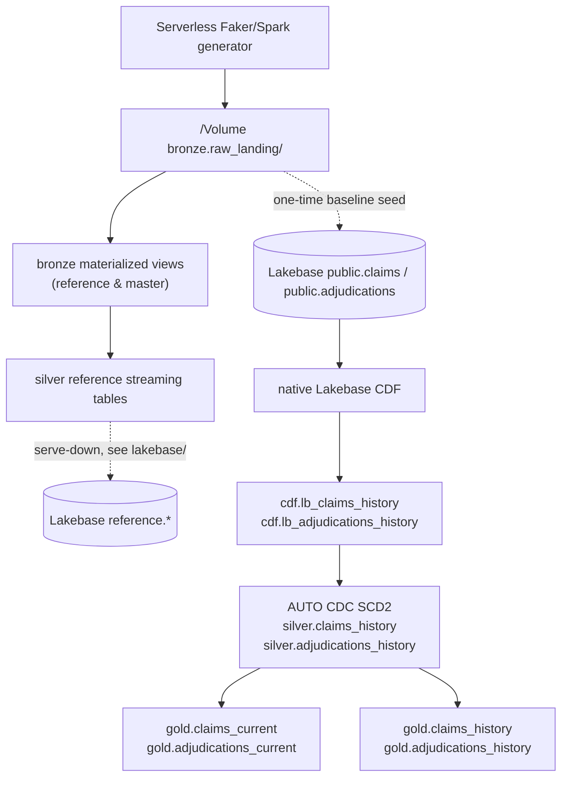

# pipelines — synthetic data, medallion pipeline, and governance

Builds the synthetic steel-claims dataset in Unity Catalog `fe-bar-ir`, publishes
reference and master data through a medallion pipeline (bronze -> silver -> gold),
ingests the live claims/adjudications history from Lakebase via native Change Data
Feed (CDF), and applies Unity Catalog governance. All compute is serverless. The
CLI wrapper always passes the `fe-bar` profile explicitly and reads settings from
`settings.yaml` (see `../config/config.example.yaml`); credentials stay in CLI
authentication and are never committed.

Policy standards and coating-warranty terms are **not** produced here — they are
authored in `agent/src/policy_source.json` and loaded into Lakebase by
`agent/src/policy_intake.py`. This layer produces only the reference, master, and
history fact data.

## Objects created

Schemas in `fe-bar-ir`: `bronze`, `silver`, `gold`, `cdf`.
Volume: `bronze.raw_landing` — the serverless generator writes raw Parquet here.

| Object | Type | Source |
| --- | --- | --- |
| `bronze.{customers, suppliers, defect_codes, heats_coils, mill_test_certs}` | Materialized view | Raw Parquet |
| `silver.{customers, suppliers, defect_codes, heats_coils, mill_test_certs}` | Streaming table | Auto Loader over raw Parquet |
| `silver.claims_history`, `silver.adjudications_history` | Streaming table | native CDF + AUTO CDC (SCD Type 2) |
| `cdf.lb_claims_history`, `cdf.lb_adjudications_history` | CDF landing | native Lakebase CDF change feed |
| `gold.claims_current`, `gold.adjudications_current` | View | current SCD2 rows (`__END_AT IS NULL`) |
| `gold.claims_history`, `gold.adjudications_history` | View | full SCD2 version timeline |

Column-mask functions in `silver`: `mask_customer`, `mask_money`.

## Resources configured

- Bundle `steel-claims`; single target `prod` (production mode), profile `fe-bar`.
- Lakeflow pipeline `medallion` — serverless, triggered; default schema `silver`;
  processes every file under `src/transformations/**`.
- Jobs: `steel-claims-validate-generator`, `steel-claims-generate-raw`,
  `steel-claims-process-cdf`.
- Governance (`governance.sql`): account groups `adjuster` and
  `metallurgy_analyst` (created only when absent; no users enrolled); SELECT on
  curated tables; column masks on customer identifiers and money — adjusters and
  workspace admins see raw values, other readers get stable hashed identifiers and
  NULL amounts. Bronze carries the same masks and no role is granted bronze or
  volume access. App/agent service-principal grants are real, conditional
  statements that run only when the principal variables are supplied.

## Data flow



Reference/master data is generated once and flows down the medallion, then serves
down to Lakebase (handled by `lakebase/`). Claims and adjudications are seeded into
Lakebase once from the same raw Parquet, after which native CDF carries every
insert/update/delete up into the `cdf` landing tables; AUTO CDC applies them into
the two SCD Type 2 silver histories, and the gold views expose current-state and
full-history projections.

## Run

Requires an authenticated Databricks CLI (>= 1.0), `uv`, an accessible UC managed
storage root, and permission to create schemas, volumes, and account groups. All
compute is serverless; there is no schedule. From the repository root:

```bash
uv run --with pyyaml python pipelines/run.py validate
uv run --with pyyaml python pipelines/run.py deploy
uv run --with pyyaml python pipelines/run.py run
uv run --with pyyaml python pipelines/run.py govern
uv run --with pyyaml python pipelines/run.py evidence
```

`run` orchestrates raw generation, the one-time Lakebase seed, CDF
creation/readiness, then the triggered AUTO CDC pipeline. It refuses to reseed once
a CDF config exists, because replacing the fixture would emit artificial
deletes/inserts and create spurious SCD2 versions. Set `synthetic.claim_count` in
`settings.yaml` (minimum 100 so every label pattern is present; scale to
20,000–50,000). `check-generator` runs the generator against temporary views as a
diagnostic only — it does not land data. Do not run the bootstrap against live data.

The synthetic historical adjudications apply the warranty version schedule sourced
from the authored policy: `run.py` reads `agent/src/policy_source.json` and passes
it to `generate.py`, so a policy edit propagates into the generated history and no
policy numbers are hardcoded here. The authoritative live coverage/settlement math
lives in the `agent/` `compute_*` authorities, never in this generator.

Each 100-claim block carries a fixed label mix (20 clean, 20 in-spec denials, 15
warranty/exclusion denials, 10 duplicates, 15 over-claims, 15 supplier-attributable,
and a 5-claim fraud cluster). The label is recorded on the finalized adjudication,
never on the claim — it is evaluation ground truth, not an input to any decision.

## Development checks

```bash
uv run --with ruff ruff check pipelines
uv run --with ruff ruff format --check pipelines
uv run --with mypy --with types-PyYAML mypy --config-file pipelines/pyproject.toml pipelines/run.py pipelines/evidence.py pipelines/src/checks.py
python3 -m compileall -q pipelines
```

Spark expressions are analyzed and executed by the serverless generator and
Lakeflow; pipeline expectations fail on invalid keys or economic invariants. The
policy intake, retrieval, deterministic authorities, and fraud-graph risk job live
under `agent/` and Lakebase.
