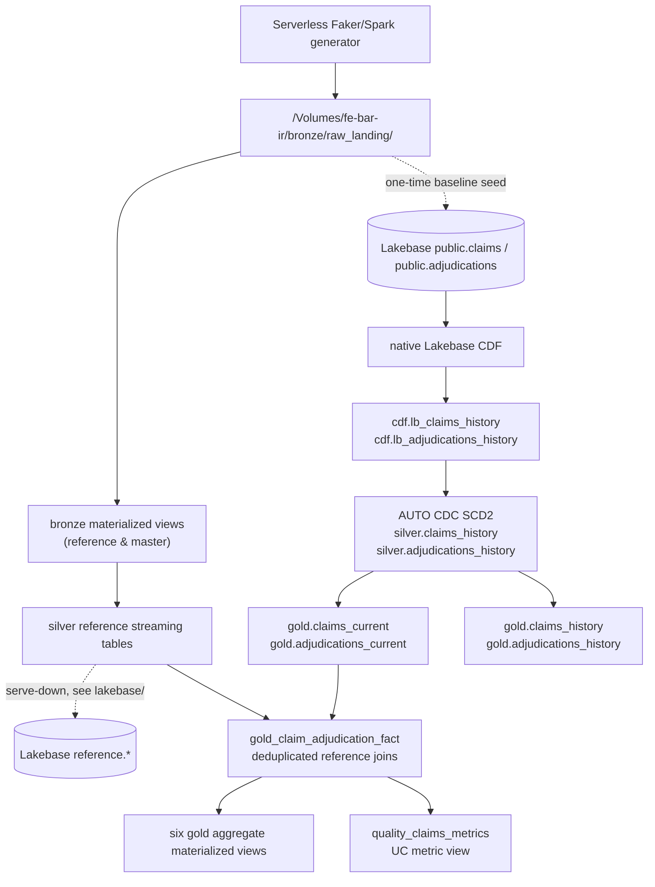

# pipelines — synthetic data, medallion pipeline, and governance

Builds the synthetic steel-claims dataset in Unity Catalog `fe-bar-ir`, publishes
reference and master data through a medallion pipeline (bronze -> silver -> gold),
ingests the live claims/adjudications history from Lakebase via native Change Data
Feed (CDF), and applies Unity Catalog governance. All compute is serverless. The
CLI wrapper always passes the `fe-bar` profile explicitly and reads settings from
`settings.yaml` (see `../config/config.example.yaml`); credentials stay in CLI
authentication and are never committed.

Policy standards and coating-warranty terms are **not** produced here — they are
authored in `lakebase/src/policy_source.json` and loaded into Lakebase by
`lakebase/src/policy_intake.py`. This layer produces only the reference, master, and
history fact data.

## Objects created

Schemas in `fe-bar-ir`: `bronze`, `silver`, `gold`, `cdf`.
Volume: `bronze.raw_landing` — the serverless generator writes raw Parquet here.

| Object | Type | Source |
| --- | --- | --- |
| `bronze.{customers, suppliers, defect_codes, heats_coils, mill_test_certs}` | Materialized view | Raw Parquet |
| `silver.{customers, suppliers, defect_codes, heats_coils, mill_test_certs}` | Streaming table | Auto Loader over raw Parquet |
| `silver.claims_history`, `silver.adjudications_history` | Streaming table | native CDF + AUTO CDC (SCD Type 2) |
| `cdf.lb_claims_history`, `cdf.lb_adjudications_history`, `cdf.lb_adjudication_decision_records_history` | CDF landing | native Lakebase CDF change feed |
| `gold.claims_current`, `gold.adjudications_current` | View | current SCD2 rows (`__END_AT IS NULL`) |
| `gold.claims_history`, `gold.adjudications_history` | View | full SCD2 version timeline |
| `gold.adjudication_decision_records` | Streaming table | append-only, immutable canonical decision record per `(adjudication_id, record_version)` |
| `gold.gold_claim_adjudication_fact` | Materialized view | Current claims and adjudications enriched with deduplicated reference, decision-record, and graph-risk attributes |
| `gold.gold_quality_kpis` | Materialized view | Daily outcomes, rates, amounts, separate value categories, and cycle time |
| `gold.gold_failure_mode_analytics` | Materialized view | Monthly defect Pareto, recurrence, affected value/tonnage, and quarantine candidates |
| `gold.gold_supplier_recovery_analytics` | Materialized view | Supplier-attributable counts and value by supplier/product/line |
| `gold.gold_fraud_cluster_analytics` | Materialized view | Fraud and graph-risk incidence by cluster/customer/heat |
| `gold.gold_agent_human_alignment` | Materialized view | Recommendation/final agreement, overrides, and amount delta by model/prompt/schema |
| `gold.gold_retrieval_citation_kpis` | Materialized view | Citation, authority-hash, and trace coverage |
| `gold.quality_claims_metrics` | UC metric view | Reusable quality outcome, amount, rate, and separate value-category measures |

Column-mask functions in `silver`: `mask_customer`, `mask_money`.

## Resources configured

- Bundle `steel-claims`; single target `prod` (production mode), profile `fe-bar`.
- Lakeflow pipeline workspace name `steel-claims` (bundle resource key `medallion`) — serverless, triggered; default schema `silver`;
  processes every file under `src/transformations/**`.
- Jobs: `steel-claims-validate-generator`, `steel-claims-generate-raw`,
  `steel-claims-refresh-medallion`.
- Governance (`governance.sql`): account groups `adjuster` and
  `metallurgy_analyst` (created only when absent; no users enrolled); SELECT on
  curated tables; column masks on customer identifiers and money — adjusters and
  workspace admins see raw values, other readers get stable hashed identifiers and
  NULL amounts. Bronze carries the same masks and no role is granted bronze or
  volume access. App/agent service-principal grants are real, conditional
  statements that run only when the principal variables are supplied.

## Data flow


```mermaid
flowchart TD
  gen["Serverless Faker/Spark generator"] --> vol["/Volumes/fe-bar-ir/bronze/raw_landing/"]

  vol --> bronze["bronze materialized views<br/>(reference & master)"]
  bronze --> silverref["silver reference streaming tables"]
  silverref -. "serve-down, see lakebase/" .-> lbref[("Lakebase reference.*")]

  vol -. "one-time baseline seed" .-> lboltp[("Lakebase public.claims / public.adjudications")]
  lboltp --> cdf["native Lakebase CDF"]
  cdf --> land["cdf.lb_claims_history<br/>cdf.lb_adjudications_history"]
  land --> scd["AUTO CDC SCD2<br/>silver.claims_history<br/>silver.adjudications_history"]
  scd --> gcur["gold.claims_current<br/>gold.adjudications_current"]
  scd --> ghist["gold.claims_history<br/>gold.adjudications_history"]
  gcur --> fact["gold_claim_adjudication_fact<br/>deduplicated reference joins"]
  silverref --> fact
  fact --> agg["six gold aggregate materialized views"]
  fact --> metrics["quality_claims_metrics<br/>UC metric view"]
```

Reference/master data is generated once and flows down the medallion, then serves
down to Lakebase (handled by `lakebase/`). Claims and adjudications are seeded into
Lakebase once from the same raw Parquet, after which native CDF carries every
insert/update/delete up into the `cdf` landing tables; AUTO CDC applies them into
the two SCD Type 2 silver histories, and the gold views expose current-state and
full-history projections.

## Execution model

Two mechanisms only (see the repo-root README):

- **DABs bundle for compute** — the medallion pipeline and all four jobs
  (`validate_generator`, `generate_raw`, `refresh_medallion`, `deploy_metric_views`).
  Plain bundle operations are run directly (below); they are never wrapped.
- **Direct `uv run python pipelines/run.py <action>` only for orchestration a plain
  `bundle run` cannot express.** `pipelines/run.py` holds *only* those actions; the
  pure `bundle validate`/`deploy`/`summary` passthroughs were removed.

## Deploy and run on the workspace

Requires an authenticated Databricks CLI (>= 1.0), `uv`, an accessible UC managed
storage root, and permission to create schemas, volumes, and account groups. All
compute is serverless; there is no schedule. The guarded end-to-end path, from the
repository root:

```bash
uv run --with pyyaml python scripts/bootstrap.py
```

**Plain DABs operations — run directly** (from `pipelines/`):

```bash
databricks bundle validate --strict --target prod --profile fe-bar
databricks bundle deploy            --target prod --profile fe-bar
databricks bundle summary           --target prod --profile fe-bar
```

**`run.py` actions — each adds orchestration a plain `bundle run` cannot express:**

```bash
uv run --with pyyaml python pipelines/run.py generate         # bundle run generate_raw + inject warranty schedule
uv run --with pyyaml python pipelines/run.py check-generator  # bundle run validate_generator + inject warranty schedule
uv run --with pyyaml python pipelines/run.py preview-status   # probe Lakebase CDF preview enablement
uv run --with pyyaml python pipelines/run.py refresh          # resolve ALL dynamic CDF table names -> deploy + run refresh_medallion
uv run --with pyyaml python pipelines/run.py decision-records # wait for CDF STREAMING, resolve tables -> deploy + run
uv run --with pyyaml python pipelines/run.py govern           # create account groups + render/execute governance.sql
uv run --with pyyaml python pipelines/run.py evidence         # capture SQL evidence snapshots
```

Why each `run.py` action is not a plain `bundle run`:

- **`generate` / `check-generator`** inject `BUNDLE_VAR_warranty_schedule`, sourced
  from `lakebase/src/policy_source.json`, as a run-time job-parameter override — so a
  policy edit propagates into the generated history and no policy numerics are
  hardcoded in the bundle (which defaults the schedule to `[]`).
- **`refresh` / `decision-records`** discover the hash-suffixed native-CDF landing
  table names at runtime and pass them as `BUNDLE_VAR_cdf_*`; the pipeline and
  `refresh_medallion` cannot resolve those names themselves. `refresh` passes every
  CDF-fed source — claims, adjudications, and decision records — so a routine run
  lands new decision records too. A missing decision-record table is an error unless
  `--allow-missing-decision-records` is passed (only before the first decision record;
  `scripts/bootstrap.py` passes it). The gold fact reads the always-defined pipeline
  view `decision_records_for_fact`, which is empty and typed while that table is
  absent, so the first medallion run on a fresh workspace succeeds. `decision-records` also
  polls until the decision-record table reaches `CDF_STATE_STREAMING`.
- **`preview-status`** reads the feature-gated CDF preview endpoint (a guard, not a
  bundle resource). **`govern`** creates account groups and renders `governance.sql`
  with validated principals. **`evidence`** captures real SQL results to
  `docs/evidence/`. None maps to a bundle resource.

The bundle resource keys are `validate_generator`, `generate_raw`,
`refresh_medallion`, `deploy_metric_views`, and pipeline `medallion`. The pipeline
and `refresh_medallion` require resolved `BUNDLE_VAR_cdf_claims_table` and
`BUNDLE_VAR_cdf_adjudications_table`; invoke them through `run.py refresh`, which
supplies those values.

`scripts/bootstrap.py` composes the guarded end-to-end path: it issues the plain
pipelines `databricks bundle deploy` directly, then `run.py generate`, the Lakebase
seed and CDF creation (via `lakebase/run.py`), an agent `fraud_graph` run that
publishes an empty typed `gold.customer_heat_risk` (the gold fact joins it and it
cannot be scored before the first medallion run), `run.py refresh`, a scoring
`fraud_graph` run, the `prior_claims_corpus` build, and a final `run.py refresh`.
Routine and demo refreshes are `scripts/refresh.py routine|demo`; see
`docs/RUNBOOK.md` for every run order and for full refresh vs routine refresh. The
CDF-exists guard is checked in the Lakebase steps, after the pipelines deploy and
`generate` have already run. If a CDF config exists, `setup-and-seed` refuses before
the Lakebase deploy or any seed, and the bootstrap stops, because replacing the
fixture would emit artificial deletes/inserts and create spurious SCD2 versions.

`decision-records` is the additive path for the append-only agent decision record.
The table is created by `lakebase/src/setup_and_seed.py` (with
`REPLICA IDENTITY FULL`, so the EXISTING schema-scoped native CDF config over
`public` picks it up once it has committed rows) and lands in UC as
`cdf.lb_adjudication_decision_records_history`. This action verifies that table
reached `CDF_STATE_STREAMING`, then deploys and runs the medallion flow that lands
it as the immutable `gold.adjudication_decision_records` (SCD Type 1 keyed on
`(adjudication_id, record_version)`, inserts only — no updates/deletes propagated;
the JSONB payload is parsed into typed structs + VARIANT). It never reseeds or
re-creates the CDF config. The decision-record DQ
(`src/checks.py:decision_record_queries`) asserts exactly one record per
`(adjudication_id, record_version)` and that no authority was overridden (a
duplicate is never payable, the approved amount is the deterministic settlement
amount, in-spec/out-of-coverage claims are never approved). Set `synthetic.claim_count` in
`settings.yaml` (minimum 100 so every label pattern is present; scale to
20,000–50,000). `check-generator` runs the generator against temporary views as a
diagnostic only — it does not land data. Do not run the bootstrap against live data.

The synthetic historical adjudications apply the warranty version schedule sourced
from the authored policy: `run.py` reads `lakebase/src/policy_source.json` and passes
it to `generate.py`, so a policy edit propagates into the generated history and no
policy numbers are hardcoded here. The authoritative live coverage/settlement math
lives in the `agent/` `compute_*` authorities, never in this generator.

Each 100-claim block carries a fixed label mix (20 clean, 20 in-spec denials, 15
warranty/exclusion denials, 10 duplicates, 15 over-claims, 15 supplier-attributable,
and a 5-claim fraud cluster). The label is recorded on the finalized adjudication,
never on the claim — it is evaluation ground truth, not an input to any decision.

## Gold analytics deployment

The analytics transformation is additive: it reads current gold objects and silver
reference tables without changing any existing streaming table or history view.
Reference inputs are reduced to one row per primary key with `row_number()` inside
the fact query before joining. This prevents the known replay duplicates in
customers, suppliers, and defect codes from inflating facts or KPIs. Aggregate
materialized views read only from that fan-out-safe fact.

From `pipelines/`, validate, deploy, run the triggered pipeline, then deploy the
metric-view SQL job. The pipeline run is a normal update; never pass a full-refresh
flag.

```bash
databricks bundle validate --strict --target prod --profile fe-bar
databricks bundle deploy --target prod --profile fe-bar
databricks bundle run refresh_medallion --target prod --profile fe-bar
databricks bundle run deploy_metric_views --target prod --profile fe-bar
uv run --with pyyaml python evidence.py
```

The metric view is committed at `src/metric_views/quality_claims_metrics.sql` and
executed by the bundle-managed `deploy_metric_views` SQL job because bundles do not
have a native metric-view resource. Workflow backlog metrics are deliberately
excluded while settlement, recovery, and investigation operational tables remain
empty. Synthetic cycle time is exposed but is expected to be nearly flat at two
days.

Follow-ups are to fix reference-dimension replay duplication at its silver root
(using the heats/coils natural-key pattern) and seed downstream operational events
before adding settlement, recovery, or investigation backlog KPIs.

## Development checks

```bash
uv run --with ruff ruff check pipelines
uv run --with ruff ruff format --check pipelines
uv run --with mypy --with types-PyYAML mypy --config-file pipelines/pyproject.toml pipelines/run.py pipelines/evidence.py pipelines/src/checks.py
python3 -m compileall -q pipelines
# Unit tests; pyspark (+ a local Java runtime) runs the decision-record bootstrap test,
# which is skipped without it.
uv run --with pytest --with pyyaml --with pyspark==4.0.1 pytest -q pipelines/tests
```

Spark expressions are analyzed and executed by the serverless generator and
Lakeflow; pipeline expectations fail on invalid keys or economic invariants. The
policy intake, retrieval, deterministic authorities, and fraud-graph risk job live
under `agent/` and Lakebase.
