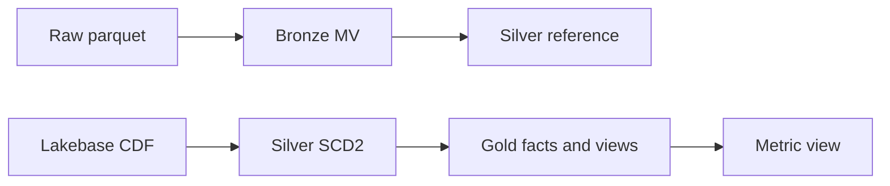

# Pipelines

## Purpose

Generate synthetic source data and maintain bronze, silver SCD2 history, gold facts, analytics, and the governed metric view.

Native Lakebase CDF changes are applied with Lakeflow AUTO CDC into SCD2 histories. Unity Catalog governance separates raw and curated access and applies column masks to sensitive identifiers and money.

## Objects created

- Pipeline `steel-claims`.
- Jobs `steel-claims-{validate-generator,generate-raw,refresh-medallion,deploy-metric-views}`.
- Bronze materialized views; silver reference and history streaming tables; gold current/history views, decision records, facts, KPIs, and `quality_claims_metrics`.
- Bootstrap-safe `decision_records_for_fact`, typed empty until decision-record CDF exists.
- `silver.claims_history` and `silver.adjudications_history`: AUTO CDC SCD Type 2 timelines; gold current views select rows whose `__END_AT` is null.

## Resources configured

Serverless triggered pipeline in catalog `fe-bar-ir`, schema `silver`; SQL warehouse `38e458a09de4a055`. Native-CDF table names are resolved dynamically by `run.py refresh`.

`governance.sql` manages account groups, curated SELECT grants, and UC column masks. Adjusters and workspace admins see raw customer identifiers and money; other readers receive hashed identifiers and null amounts. Bronze has the same masks but no reader grant.

## Data flow


```mermaid
flowchart LR
  F[Raw parquet] --> B[Bronze MV] --> S[Silver reference]
  C[Lakebase CDF] --> H[Silver SCD2] --> G[Gold facts and views] --> M[Metric view]
```

Reference data flows raw → bronze → silver. Operational changes flow Lakebase CDF → landing → AUTO CDC SCD2 histories → gold current/history views. Governance and column masks apply at Unity Catalog objects rather than in application code.

## Deploy

Working directory: `pipelines/`.

```bash
databricks bundle validate --strict -t prod --profile fe-bar
databricks bundle deploy -t prod --profile fe-bar
```

## Run

Working directory: repository root for wrappers; `pipelines/` for the metric-view job.

```bash
uv run --with pyyaml python pipelines/run.py generate
uv run --with pyyaml python pipelines/run.py refresh
cd pipelines
databricks bundle run deploy_metric_views -t prod --profile fe-bar
```

Do not run `refresh_medallion` directly: the wrapper resolves all native-CDF names. Full refresh is reserved for the schema-change procedure in the runbook.

## Verify

Working directory: repository root. Read-only:

```bash
databricks pipelines list-pipelines --profile fe-bar -o json
databricks experimental aitools tools query --warehouse 38e458a09de4a055 --profile fe-bar -o json 'SELECT table_schema, table_name, table_type FROM `fe-bar-ir`.information_schema.tables WHERE table_schema IN ("bronze","silver","gold","cdf") ORDER BY 1,2'
```

Expected: pipeline `steel-claims` is `IDLE` with latest update `COMPLETED`; the inventory includes the published types captured in [UC evidence](../docs/evidence/current-state/uc-inventory.json).

## Status

2026-10-01: repo head includes the bootstrap gap fix. The deployed pipeline is idle after a completed update; current counts are 5,000 claims and 4,999 corpus rows.
