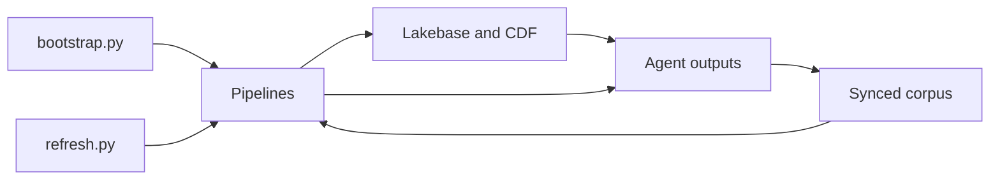

# Cross-layer composers

## Purpose

Compose the guarded one-time bootstrap and routine/demo refresh orders without hiding plain bundle operations.

## Objects created

No platform objects directly. `bootstrap.py` and `refresh.py` orchestrate resources owned by other layers.

## Resources configured

Bootstrap sequences pipelines, Lakebase, CDF, fraud graph, corpus, and medallion. Routine refresh sequences medallion, risk, corpus, triggered re-sync, and final medallion.

## Data flow



## Deploy

There is no scripts bundle. Deploy the owning layer bundles as specified in the runbook.

## Run

Working directory: repository root.

```bash
uv run --with pyyaml python scripts/bootstrap.py
uv run --with pyyaml python scripts/refresh.py routine
uv run --with pyyaml python scripts/refresh.py demo
```

After bootstrap, create synced tables only after app and serving principals exist: `uv run --with pyyaml python lakebase/run.py synced-tables`. Before routine refresh on an upgraded workspace, perform the one-time corpus cutover so `reference.prior_claims_corpus`, its indexes, and both principal grants are live; do not treat routine refresh as the cutover.

## Verify

Working directory: repository root. Read-only:

```bash
databricks postgres get-synced-table synced_tables/fe_bar_operational.reference.prior_claims_corpus --profile fe-bar -o json
databricks pipelines list-pipelines --profile fe-bar -o json
```

Expected: corpus state starts with `SYNCED_TABLE_ONLINE`; medallion and all seven sync pipelines are idle after completed updates.

Development checks from the repository root: `uv run --with ruff ruff check scripts && uv run --with pytest --with pyyaml pytest -q pipelines/tests`.

## Status

2026-10-01: repo head includes the bootstrap fallback and corpus refresh ordering. The one-time corpus cutover is complete on `fe-bar`; routine refresh may be used.
