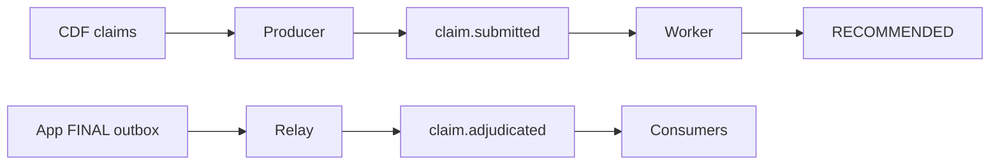

# Services

## Purpose

Provide the optional Kafka event backbone: publish submitted claims, obtain persisted recommendations, relay finalized outbox events, and fan them out to downstream consumers.

## Objects created

Bundle jobs `migrate`, `producer`, `worker`, `relay`, and `consumers`; topics `claim.submitted` and `claim.adjudicated`.

## Resources configured

Secret scope `fe-bar-aiven-kafka` requires four Kafka keys defined by the resource files. `migrate` applies schema/grants first; dropping legacy `claims_pending` is cleanup, not its primary purpose. Jobs are independent hourly schedules, so ordering is eventual unless driven manually.

## Data flow



## Deploy

Secret writes are mutating and must be performed deliberately before deployment:

```bash
databricks secrets put-secret fe-bar-aiven-kafka <key> --profile fe-bar
```

Working directory: `services/`. Deploy schedules paused, then activate explicitly:

```bash
databricks bundle validate --strict -t prod --profile fe-bar
databricks bundle deploy -t prod --profile fe-bar
databricks bundle run migrate -t prod --profile fe-bar
```

## Run

Working directory: `services/`. For guaranteed manual ordering:

```bash
databricks bundle run producer -t prod --profile fe-bar
databricks bundle run worker -t prod --profile fe-bar
databricks bundle run relay -t prod --profile fe-bar
databricks bundle run consumers -t prod --profile fe-bar
```

## Verify

Working directory: `services/`. Read-only:

```bash
databricks secrets list-secrets fe-bar-aiven-kafka --profile fe-bar -o json
databricks jobs list --profile fe-bar -o json
```

Expected before deployment: all required secret key names exist; values are never returned. Expected after deployment: five `fe-bar-services-*` jobs exist and intended schedules show the chosen pause state.

## Status

2026-10-01: built at repo head but not deployed on `fe-bar`; no services jobs were returned. Live Kafka end-to-end evidence remains pending.
