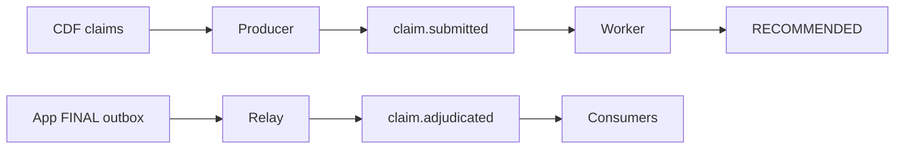

# Services

## Purpose

Provide the optional Kafka event backbone: publish submitted claims, obtain persisted recommendations, relay finalized outbox events, and fan them out to downstream consumers.

The contract is at-least-once delivery with exactly-once business effect. Stable event and case identifiers support dedup at every boundary; retries and broker re-delivery become no-ops through idempotent consumers and transactional first-write-wins operations.

## Objects created

Bundle jobs `migrate`, `producer`, `worker`, `relay`, and `consumers`; topics `claim.submitted` and `claim.adjudicated`.

The producer keys events by `claim_id`; the worker deduplicates an existing agent recommendation; the agent writer atomically inserts a RECOMMENDED adjudication and decision record. App finalization atomically writes FINAL state, a new decision-record version, and the deterministic outbox event.

## Resources configured

Secret scope `fe-bar-aiven-kafka` requires `bootstrap-servers`, `sasl-username`, `sasl-password`, and `ssl-ca-pem`. Scope `claims-agent` requires `app-sp-client-id` and `app-sp-client-secret`. `migrate` applies schema/grants first; dropping legacy `claims_pending` is cleanup, not its primary purpose. Jobs are independent hourly schedules, so ordering is eventual unless driven manually.

The relay sets `published_at` only after broker acknowledgement. A crash can republish, so downstream consumers use deterministic `STL-`, `INV-`, and `SRC-<claim_id>` keys with UPSERT/ON CONFLICT semantics. This is idempotent apply, not a claim that Kafka itself delivers exactly once.

## Data flow



Checkpoint replay, worker retry, relay retry, and repeated consumer delivery therefore cannot create a second business outcome. `max_concurrent_runs: 1` bounds relay concurrency; consumer idempotency is the deeper dedup guarantee.

## Deploy

Scope creation and secret writes are mutating and must be performed deliberately before deployment:

```bash
databricks secrets create-scope fe-bar-aiven-kafka --profile fe-bar
databricks secrets create-scope claims-agent --profile fe-bar
databricks secrets put-secret fe-bar-aiven-kafka bootstrap-servers --profile fe-bar
databricks secrets put-secret fe-bar-aiven-kafka sasl-username --profile fe-bar
databricks secrets put-secret fe-bar-aiven-kafka sasl-password --profile fe-bar
databricks secrets put-secret fe-bar-aiven-kafka ssl-ca-pem --profile fe-bar
databricks secrets put-secret claims-agent app-sp-client-id --profile fe-bar
databricks secrets put-secret claims-agent app-sp-client-secret --profile fe-bar
```

Working directory: `services/`. All four schedules are authored `UNPAUSED`; production mode does not pause them. Deploy only after both scopes contain every key, or producer, worker, relay, and consumers start failing on their hourly schedules.

```bash
databricks bundle validate --strict -t prod --profile fe-bar
databricks bundle deploy -t prod --profile fe-bar
databricks bundle run migrate -t prod --profile fe-bar
```

## Run

Working directory: `services/`. For guaranteed manual ordering:

```bash
databricks bundle run producer -t prod --profile fe-bar
databricks bundle run worker -t prod --profile fe-bar
databricks bundle run relay -t prod --profile fe-bar
databricks bundle run consumers -t prod --profile fe-bar
```

## Verify

Working directory: `services/`. Read-only:

```bash
databricks secrets list-secrets fe-bar-aiven-kafka --profile fe-bar -o json
databricks secrets list-secrets claims-agent --profile fe-bar -o json
databricks jobs list --profile fe-bar -o json
```

Expected before deployment: all six required key names exist; values are never returned. Expected after deployment: five `fe-bar-services-*` jobs exist and the four processing schedules are `UNPAUSED`.

To pause or resume a deployed schedule, use the Jobs UI: Workflows → Jobs & Pipelines → select the job → Schedule & Triggers → toggle the schedule. CLI 1.17 `jobs update JOB_ID --json ...` is a partial-update API, but changing `schedule` requires carrying forward the job's complete cron and timezone; the UI toggle avoids accidentally replacing those fields.

Development checks from `services/`: `uv run pytest -q && uv run --with ruff ruff check . && uv run --with ruff ruff format --check .`.

## Status

2026-10-01: built at repo head but not deployed on `fe-bar`; no services jobs were returned. Live Kafka end-to-end evidence remains pending.
